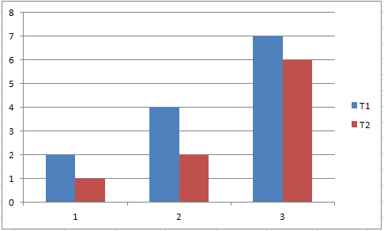

{}

Sometimes, the user needs to know if a particular axis exists in the chart. For example, he wants to know if a secondary value axis exists inside the chart or not. Some charts like Pie, PieExploded, PiePie, PieBar, Pie3D, Pie3DExploded, Doughnut, DoughnutExploded, etc. do not have an axis.

Aspose.Cells provides the **Chart.hasAxis(int axisType, boolean isPrimary)** method to determine if the chart has a particular axis or not.

{}

## Determine which Axis exists in the Chart

The following screenshot shows a chart that has only the primary category and value axis. It does not have any secondary category or value axis.

The following sample code demonstrates the use of **Chart.hasAxis(int axisType, boolean isPrimary)** to determine if the sample chart has primary and secondary category and value axes. The console output of the code is shown below, which displays `true` for the primary category and value axes and `false` for the secondary category and value axes.

### Java code to determine which axes exist in the chart



### Console output generated by the sample code

Here is the console output of the above sample code.



Has Primary Category Axis: true

Has Secondary Category Axis: false

Has Primary Value Axis: true

Has Secondary Value Axis: false



