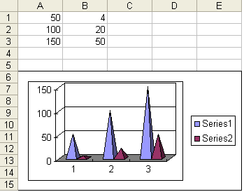
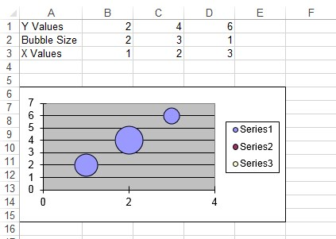
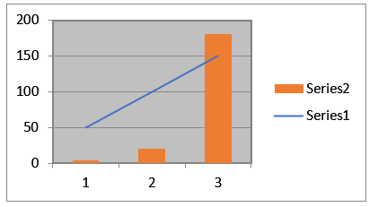

## **Creating Charts**

It is possible to add a variety of charts to spreadsheets with Aspose.Cells. Aspose.Cells provides many flexible charting objects. This topic discusses Aspose.Cells' charting objects.

### **Simply Creating a Chart**

It's simple to create a chart with Aspose.Cells with the following example codes:



### **Things to Know For Creating a Chart**

Before creating charts it's important to understand some basic concepts that are helpful when creating charts using Aspose.Cells.

#### **Charting Objects**

Aspose.Cells provides a special set of classes used to create all kinds of charts. These classes are used to create **charting objects**, which act as the chart building blocks. The charting objects are listed below:

- [**Axis**](https://reference.aspose.com/cells/java/com.aspose.cells/Axis), a chart's axis.
- [**Chart**](https://reference.aspose.com/cells/java/com.aspose.cells/Chart), a single Excel chart.
- [**ChartArea**](https://reference.aspose.com/cells/java/com.aspose.cells/ChartArea), the chart area in the worksheet.
- [**ChartDataTable**](https://reference.aspose.com/cells/java/com.aspose.cells/ChartDataTable), a chart data table.
- [**ChartFrame**](https://reference.aspose.com/cells/java/com.aspose.cells/ChartFrame), the frame object in a chart.
- [**ChartPoint**](https://reference.aspose.com/cells/java/com.aspose.cells/ChartPoint), a single point in a series in a chart.
- [**ChartPointCollection**](https://reference.aspose.com/cells/java/com.aspose.cells/ChartPointCollection), a collection that contains all the points in one series.
- [**ChartCollection**](https://reference.aspose.com/cells/java/com.aspose.cells/ChartCollection), a collection of [**Chart**](https://reference.aspose.com/cells/java/com.aspose.cells/Chart) objects.
- DataLabels, DataLabels for the specified [**Series**](https://reference.aspose.com/cells/java/com.aspose.cells/Series), [**ChartPoint**](https://reference.aspose.com/cells/java/com.aspose.cells/ChartPoint), [**Trendline**](https://reference.aspose.com/cells/java/com.aspose.cells/Trendline), etc.
- [**FillFormat**](https://reference.aspose.com/cells/java/com.aspose.cells/FillFormat), fill format for a shape.
- [**Floor**](https://reference.aspose.com/cells/java/com.aspose.cells/Floor), the floor of a 3D chart.
- [**Legend**](https://reference.aspose.com/cells/java/com.aspose.cells/Legend), the chart legend.
- [**Line**](https://reference.aspose.com/cells/java/com.aspose.cells/Line), the chart line.
- [**SeriesCollection**](https://reference.aspose.com/cells/java/com.aspose.cells/SeriesCollection), a collection of [**Series**](https://reference.aspose.com/cells/java/com.aspose.cells/Series) objects.
- [**Series**](https://reference.aspose.com/cells/java/com.aspose.cells/Series), represents a single data series in a chart.
- [**TickLabels**](https://reference.aspose.com/cells/java/com.aspose.cells/TickLabels), the tick mark labels associated with tick marks on a chart axis.
- [**Title**](https://reference.aspose.com/cells/java/com.aspose.cells/Title), the title of a chart or axis.
- [**Trendline**](https://reference.aspose.com/cells/java/com.aspose.cells/Trendline), a trendline in a chart.
- [**TrendlineCollection**](https://reference.aspose.com/cells/java/com.aspose.cells/TrendlineCollection), a collection of all Trendline objects for the specified data series.
- [**Walls**](https://reference.aspose.com/cells/java/com.aspose.cells/Walls), the walls of a 3D chart.

#### **Using Charting Objects**

As mentioned above, all charting objects are instances of their respective classes and provide specific properties and methods to perform specific tasks. Use charting objects to create charts.

Add any type of chart to a worksheet using the [**ChartCollection**](https://reference.aspose.com/cells/java/com.aspose.cells/ChartCollection) collection. Each item in the [**ChartCollection**](https://reference.aspose.com/cells/java/com.aspose.cells/ChartCollection) collection represents a [**Chart**](https://reference.aspose.com/cells/java/com.aspose.cells/Chart) object. A [**Chart**](https://reference.aspose.com/cells/java/com.aspose.cells/Chart) object encapsulates all Charting Objects required to customize the appearance of the chart. The next section shows how to use a few basic charting objects to create a simple chart.

### **Creating a Simple Chart**

It is possible to create many different types of charts with Aspose.Cells. All standard charts supported by Aspose.Cells are pre-defined in an enumeration named [**ChartType**](https://reference.aspose.com/cells/java/com.aspose.cells/ChartType). The pre-defined chart types are:

|**Chart Types**|**Description**|
| :- | :- |
|Column|Represents the Clustered Column Chart|
|ColumnStacked|Represents Stacked Column Chart|
|Column100PercentStacked|Represents 100% Stacked Column Chart|
|Column3DClustered|Represents 3D Clustered Column Chart|
|Column3DStacked|Represents 3D Stacked Column Chart|
|Column3D100PercentStacked|Represents 3D 100% Stacked Column Chart|
|Column3D|Represents 3D Column Chart|
|Bar|Represents Clustered Bar Chart|
|BarStacked|Represents Stacked Bar Chart|
|Bar100PercentStacked|Represents 100% Stacked Bar Chart|
|Bar3DClustered|Represents 3D Clustered Bar Chart|
|Bar3DStacked|Represents 3D Stacked Bar Chart|
|Bar3D100PercentStacked|Represents 3D 100% Stacked Bar Chart|
|Line|Represents Line Chart|
|LineStacked|Represents Stacked Line Chart|
|Line100PercentStacked|Represents 100% Stacked Line Chart|
|LineWithDataMarkers|Represents Line Chart with data markers|
|LineStackedWithDataMarkers|Represents Stacked Line Chart with data markers|
|Line100PercentStackedWithDataMarkers|Represents 100% Stacked Line Chart with data markers|
|Line3D|Represents 3D Line Chart|
|Pie|Represents Pie Chart|
|Pie3D|Represents 3D Pie Chart|
|PiePie|Represents Pie of Pie Chart|
|PieExploded|Represents Exploded Pie Chart|
|Pie3DExploded|Represents 3D Exploded Pie Chart|
|PieBar|Represents Bar of Pie Chart|
|Scatter|Represents the Scatter Chart|
|ScatterConnectedByCurvesWithDataMarker|Represents the Scatter Chart connected by curves, with data markers|
|ScatterConnectedByCurvesWithoutDataMarker|Represents the Scatter Chart connected by curves, without data markers|
|ScatterConnectedByLinesWithDataMarker|Represents the Scatter Chart connected by lines, with data markers|
|ScatterConnectedByLinesWithoutDataMarker|Represents the Scatter Chart connected by lines, without data markers|
|Area|Represents Area Chart|
|AreaStacked|Represents Stacked Area Chart|
|Area100PercentStacked|Represents 100% Stacked Area Chart|
|Area3D|Represents 3D Area Chart|
|Area3DStacked|Represents 3D Stacked Area Chart|
|Area3D100PercentStacked|Represents 3D 100% Stacked Area Chart|
|Doughnut|Represents Doughnut Chart|
|DoughnutExploded|Represents Exploded Doughnut Chart|
|Radar|Represents the Radar Chart|
|RadarWithDataMarkers|Represents the Radar Chart with data markers|
|RadarFilled|Represents Filled Radar Chart|
|Surface3D|Represents 3D Surface Chart|
|SurfaceWireframe3D|Represents the Wireframe 3D Surface Chart|
|SurfaceContour|Represents Contour Chart|
|SurfaceContourWireframe|Represents Wireframe Contour Chart|
|Bubble|Represents Bubble Chart|
|Bubble3D|Represents 3D Bubble Chart|
|Cylinder|Represents Cylinder Chart|
|CylinderStacked|Represents Stacked Cylinder Chart|
|Cylinder100PercentStacked|Represents 100% Stacked Cylinder Chart|
|CylindricalBar|Represents Cylindrical Bar Chart.|
|CylindricalBarStacked|Represents Stacked Cylindrical Bar Chart|
|CylindricalBar100PercentStacked|Represents 100% Stacked Cylindrical Bar Chart|
|CylindricalColumn3D|Represents 3D Cylindrical Column Chart|
|Cone|Represents Cone Chart|
|ConeStacked|Represents Stacked Cone Chart|
|Cone100PercentStacked|Represents 100% Stacked Cone Chart|
|ConicalBar|Represents Conical Bar Chart|
|ConicalBarStacked|Represents Stacked Conical Bar Chart|
|ConicalBar100PercentStacked|Represents 100% Stacked Conical Bar Chart|
|ConicalColumn3D|Represents 3D Conical Column Chart|
|Pyramid|Represents Pyramid Chart|
|PyramidStacked|Represents Stacked Pyramid Chart|
|Pyramid100PercentStacked|Represents 100% Stacked Pyramid Chart|
|PyramidBar|Represents the Pyramid Bar Chart|
|PyramidBarStacked|Represents Stacked Pyramid Bar Chart|
|PyramidBar100PercentStacked|Represents 100% Stacked Pyramid Bar Chart|
|PyramidColumn3D|Represents 3D Pyramid Column Chart|
To create a chart using Aspose.Cells:

1. Add some data to worksheet cells with the [**Cell**](https://reference.aspose.com/cells/java/com.aspose.cells/Cell) object's [**setValue**](https://reference.aspose.com/cells/java/com.aspose.cells/cell#setValue-java.lang.Object-) method.
   This will be used as the data source for the chart.
1. Add a chart to the worksheet by calling the [**ChartCollection**](https://reference.aspose.com/cells/java/com.aspose.cells/ChartCollection) collection's [*add*](https://reference.aspose.com/cells/java/com.aspose.cells/chartcollection#add-int-int-int-int-int-) method, encapsulated in the [**Worksheet**](https://reference.aspose.com/cells/java/com.aspose.cells/Worksheet) object.
1. Specify the type of chart with the [**ChartType**](https://reference.aspose.com/cells/java/com.aspose.cells/ChartType) enumeration.
   For example, the example uses the [**ChartType.PYRAMID**](https://reference.aspose.com/cells/java/com.aspose.cells/charttype#PYRAMID) value as the chart type.
1. Access the new [**Chart**](https://reference.aspose.com/cells/java/com.aspose.cells/Chart) object from the [**ChartCollection**](https://reference.aspose.com/cells/java/com.aspose.cells/ChartCollection) collection by passing its index.
1. Use any of the charting objects encapsulated in the [**Chart**](https://reference.aspose.com/cells/java/com.aspose.cells/Chart) object to manage the chart.
   The example below uses the [**SeriesCollection**](https://reference.aspose.com/cells/java/com.aspose.cells/SeriesCollection) charting object to specify the chart's data source.

When adding source data to chart, the data source can be a range of cells (such as "A1:C3"), or a sequence of non-contiguous cells (such as "A1, A3, A5"), or a sequence of values (such as "1,2,3").

{}

When you assign a range of cells as a data source, you can only set the range from top left to bottom right. For example, "A1:C3" is valid while "C3:A1" is invalid.

{}

These general steps allow you to create any type of chart. Use different charting objects to create different charts.

When the example code is executed, a pyramid chart is added to the worksheet as shown below.

**Pyramid chart with its data source**



To create a bubble chart, the [**ChartType**](https://reference.aspose.com/cells/java/com.aspose.cells/ChartType) has to be set to [**ChartType.BUBBLE**](https://reference.aspose.com/cells/java/com.aspose.cells/charttype#BUBBLE) and few extra properties such as BubbleSizes, Values & XValues need to be set accordingly. Upon executing the following code, a bubble chart is added to the worksheet as shown below.

**Bubble chart with its data source**



#### **Line with Data Marker Chart**

To create a line with a data marker chart, the [**ChartType**](https://reference.aspose.com/cells/java/com.aspose.cells/ChartType) has to be set to [**ChartType.LINE_WITH_DATA_MARKERS**](https://reference.aspose.com/cells/java/com.aspose.cells/charttype#LINE-WITH-DATA-MARKERS) and few extra properties such as background area,Series Markers , Values & XValues need to be set accordingly. Upon executing the following code, a line with a data marker chart is added to the worksheet.



## **Creating Custom Charts**

So far, when we've discussed charts, we've looked at standard charts that have their standard formatting settings. We only define the data source, set a few properties and the chart is created with its default format settings. But Aspose.Cells also supports creating custom charts that allows developers to create charts with their own format settings.

### **Creating Custom Charts**

Developers can create custom charts at runtime using Aspose.Cells simple API.

A chart is composed of a data series. Each data series in Aspose.Cells is represented by a [**Series**](https://reference.aspose.com/cells/java/com.aspose.cells/Series) object whereas the [**SeriesCollection**](https://reference.aspose.com/cells/java/com.aspose.cells/SeriesCollection) object serves as a collection of [**Series**](https://reference.aspose.com/cells/java/com.aspose.cells/Series) objects. When creating a custom chart, developers have the freedom to use different types of charts for different data series (collected in a [**SeriesCollection**](https://reference.aspose.com/cells/java/com.aspose.cells/SeriesCollection) object).

{}

Currently Aspose.Cells only supports custom charts that combine pie, line, column and column stack charts but more charts will be supported in future releases. For a full list of the standard charts that Aspose.Cells supports, read the [Chart Types](/cells/java/chart-types/) article.

{}

The example code below demonstrates how to create custom charts. In this example, we are going to use a column chart for the first data series and a line chart for the second series. The result is that we add a column chart, combined with a line chart, to the worksheet.

**Custom chart combining column and line charts**

**Programming Example**



{}

To see a list of supported chart types, read the [Chart Types](/cells/java/chart-types/) article.

{}


