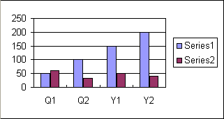

{}

In our previous topics, we have already provided many examples to demonstrate that how can you set a data source for your chart but in this topic, we are going to provide more details about the types of data that can be set for a chart.

{}

## **Setting Chart Data**

There are two types of data to deal with while working on charts using Aspose.Cells as follows:

- [Chart data](/cells/java/data-formatting-in-charts/#chart-data).
- [Category data](/cells/java/data-formatting-in-charts/#category-data).

### **Chart Data**

Chart data is that data that we use as a data source to build our charts. We can add a range of the cells (containing chart data) by calling the [**SeriesCollection**](https://reference.aspose.com/cells/java/com.aspose.cells/SeriesCollection) object's [**Add**](https://reference.aspose.com/cells/java/com.aspose.cells/seriescollection#add-java.lang.Object-) method.



### **Category Data**

Category data is used for the labeling of chart data and can be added to [**SeriesCollection**](https://reference.aspose.com/cells/java/com.aspose.cells/SeriesCollection) by using its [**setCategoryData**](https://reference.aspose.com/cells/java/com.aspose.cells/seriescollection#setCategoryData-java.lang.String-) method.



**Column chart with chart & category data** 

## **Advance topics**
- [Create Dynamic Charts](/cells/java/create-dynamic-charts/)
- [Easy way for Chart Setup using Chart.setChartDataRange method](/cells/java/easy-way-for-chart-setup-using-chart-setchartdatarange-method/)
- [Find Type of X and Y Values of Points in Chart Series](/cells/java/find-type-of-x-and-y-values-of-points-in-chart-series/)
- [Set the Values Format Code of Chart Series](/cells/java/set-the-values-format-code-of-chart-series/)

