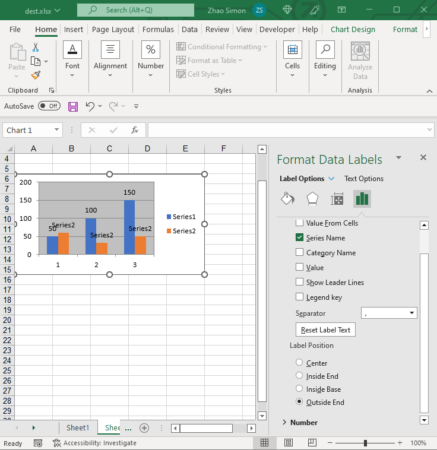

{}

DataLabels are an important part of a chart.  
We can easily see the value, percentage, etc., of each series.

{}

## **DataLabels Options**
Aspose.Cells also allows you to manage a chart's DataLabels at runtime. With the [DataLabels](https://reference.aspose.com/cells/java/com.aspose.cells/DataLabels) object, it’s simple to move, update, and format the DataLabels of the chart.

||

## **Manage the Data Labels of a Chart**
It’s simple to manage the chart’s DataLabels using Aspose.Cells [DataLabels](https://reference.aspose.com/cells/java/com.aspose.cells/DataLabels).

The following code snippet demonstrates how to manage DataLabels:



## **Advanced Topics**
- [Adding Custom Labels to Data Points in the Series of the Chart](/cells/java/adding-custom-labels-to-data-points-in-the-series-of-the-chart/)
- [Disable Text Wrapping for Data Labels of the Chart](/cells/java/disable-text-wrapping-for-data-labels-of-the-chart/)
- [Read Axis Labels after Calculating the Chart](/cells/java/read-axis-labels-after-calculating-the-chart/)
- [Resize Chart's Data Label Shape To Fit Text](/cells/java/resize-chart-s-data-label-shape-to-fit-text/)
- [Rich Text Custom Data Label of Chart Point](/cells/java/rich-text-custom-data-label-of-chart-point/)
- [Set the Shape Type of Data Labels of Chart](/cells/java/set-the-shape-type-of-data-labels-of-chart/)
- [Showing Cell Range as Data Labels](/cells/java/showing-cell-range-as-the-data-labels/)

