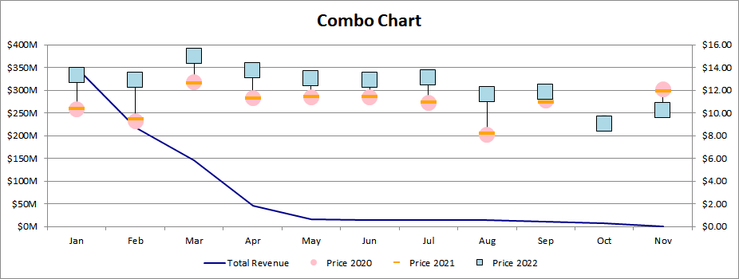

## **Possible Usage Scenarios**
Combo charts in Excel let you avail of this option because you can easily combine two or more chart types to make your data understandable. Combo charts are helpful when your data contains multiple kinds of values including price and volume. Moreover, Combo charts are feasible when your data numbers change widely from series to series.
Taking the following dataset as an example, we can observe that these data are quite similar to the data mentioned in [**VHCL**](https://docs.aspose.com/cells/java/create-volume-high-low-close-stock-chart/). If we want to visualize series0, which corresponds to "Total Revenue," as a Line chart, how should we proceed?

## **Combo chart**
After running the code below, you will see the Combo chart as shown below.

## **Sample Code**
The following sample code loads the [sample Excel file](combo.xlsx) and generates the [output Excel file](out.xlsx).


