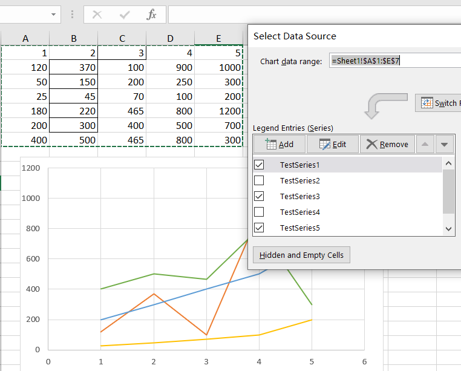

## How to set series invisible in Excel Chart

In an Excel chart, you can right‑click a chart, click **Select Data**, and in the pop‑up window, you can set whether a series is visible by checking or unchecking it.  
You can download the following [sample file](SeriesFiltered.xlsx) and operate it in Excel as shown in the figure to achieve this function. Next, we will tell you how to achieve this using the Aspose.Cells library.

## How to set series invisible using Aspose.Cells 

We use the following code to set a series invisible using Aspose.Cells:



You can get the following [Input file](SeriesFiltered.xlsx) and [output file](output.xlsx).

As shown in the figure below, the first two series which were originally visible have become invisible in the output file.  


