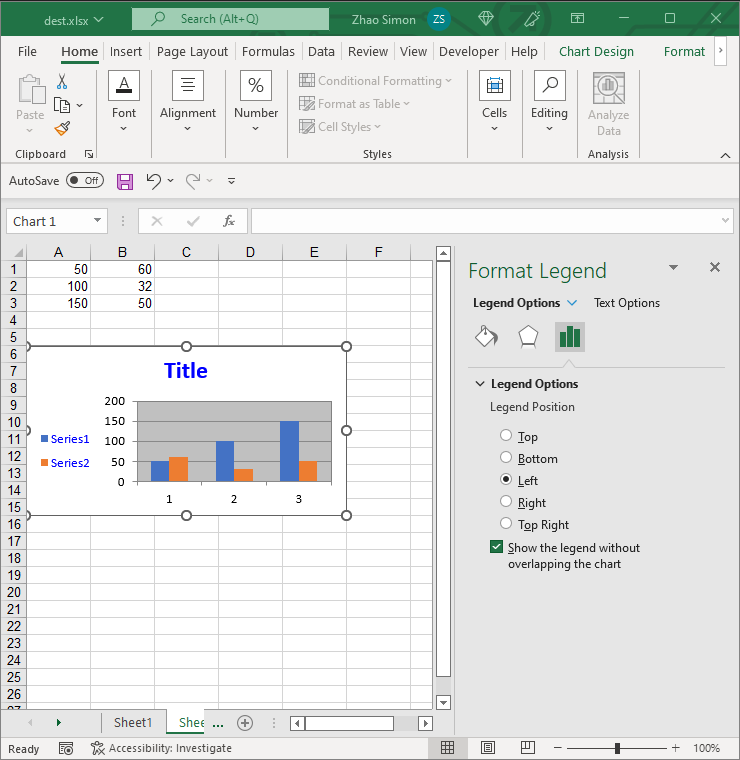

## **Legend Options**
Aspose.Cells also allows to manage chart's legend at runtime，with [Legend](https://reference.aspose.com/cells/java/com.aspose.cells/Legend) object, legend could be moved , updated and formatted.

||

## **Setting the Legend of Chart**
It's simple to manage legend of the chart with Aspose.Cells [Legend](https://reference.aspose.com/cells/java/com.aspose.cells/Legend).

The following code snippet demonstrates how to manage legend:



## **Advance topics**
- [Set text of chart legend entry fill to none using Aspose.Cells](/cells/java/set-text-of-chart-legend-entry-fill-to-none-using-aspose-cells/)