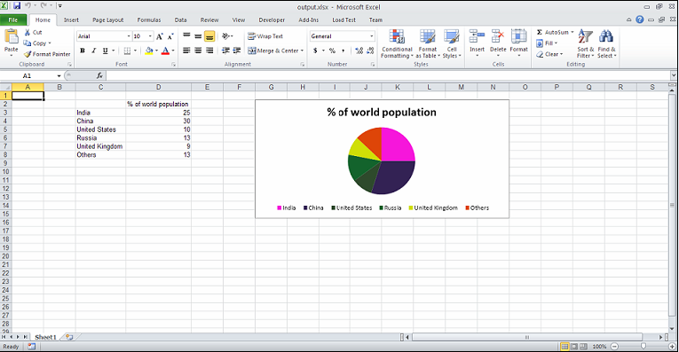

{}

This article explains how to add custom colors to pie chart slices/sectors. By default, pie charts use the Microsoft Excel default template. To use other colors, it is possible to redefine the colors in the chart.

{}

To set the custom color for a pie chart's individual slices or sectors:

1. Access the [**Series**](https://reference.aspose.com/cells/java/com.aspose.cells/Series) object's [**ChartPoint**](https://reference.aspose.com/cells/java/com.aspose.cells/ChartPoint).
1. Assign a color of your choice using the [**ChartPoint.getArea().setForegroundColor()**](https://reference.aspose.com/cells/java/com.aspose.cells/area#ForegroundColor) method.

This article also explains how to set:

- A chart's category data.
- A chart title linked to a cell.
- The chart title font settings.
- The position of the legend.

{}

[**ChartPoint.getArea().setForegroundColor()**](https://reference.aspose.com/cells/java/com.aspose.cells/area#ForegroundColor) is not specific to pie charts but can be used for all types of charts.

{}

**Custom slice colors in the pie chart**


