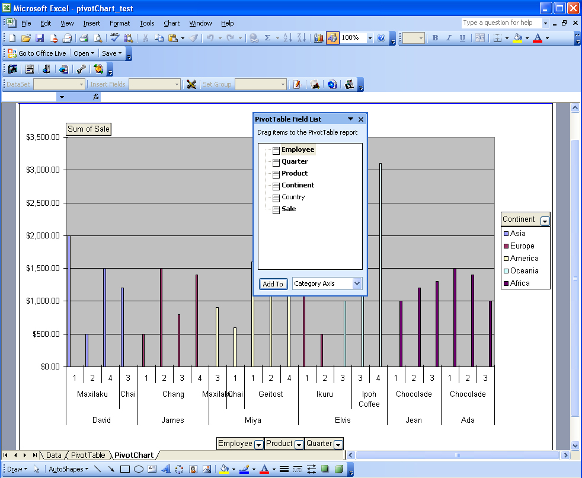

## What is PivotChart

A PivotChart in Excel is a graphical representation of data created from a PivotTable. It allows users to visualize and analyze data dynamically by summarizing and displaying information in chart form. PivotCharts are interactive and can be easily modified to show different perspectives of the data, making it a powerful tool for data analysis and presentation in Excel.

## How to add a PivotChart using Aspose.Cells
### **Creating a Pivot Table**

To create a pivot table using Aspose.Cells:

1. Add some data to a worksheet cells using a Cell object's PutValue/setValue method. You also use a template file already filled with data. The data will be used as the pivot table's data source.
1. Add a pivot table to the worksheet by calling the PivotTables collection's add method (encapsulated in the Worksheet object).
1. Access the new PivotTable object from the PivotTables collection by passing its index.
1. Use any of the pivot table objects encapsulated in the PivotTable object to manage the table.

A code sample is given below. Executing the code generates a new file: pivotTable_test.xls.

**Input data** 

**The output pivot table**



### **Creating a Pivot Chart based on the Pivot Table**

To create a pivot chart using Aspose.Cells:

1. Add a chart.
1. Set the PivotSource of the chart to refer to an existing pivot table in the spreadsheet.
1. Set other attributes.

Below is the code used by the component to accomplish the task. Executing the code generates a new file: pivotChart_test.xls.

**The pivot chart sheet**



{}

This article shows how to create pivot tables and pivot charts using Aspose.Cells. Hopefully, it will help you use these features in your own scenarios.

Aspose.Cells has benefited from years of research, design and careful tuning.

We welcome your queries, comments and suggestions at [Aspose.Cells Forum](https://forum.aspose.com/c/cells/9). We warranty a prompt reply.

{}
