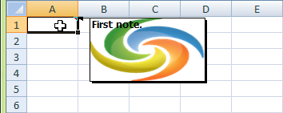

{}

Microsoft Excel lets users customize the look and feel of spreadsheets to a great extent. It is even possible to add background pictures to comments.

Comments are added to cells to record comments, anything from the details of how a formula is worked, where a value comes from or questions from reviewers. Adding a background image can be an aesthetic choice, or be used to strengthen branding.

{}

## Add picture to Excel Comment with Microsoft Excel

With Microsoft Excel 2007, it is possible to have an image as the background to a cell comment. In Excel 2007, this is accomplished (supposing the comment has already been added) this way:

1. Right-click the cell which contains the comment.
1. Choose **Show/Hide Comments** and clear any text from the comment.
1. Click on the border of the comment to select it.
1. Choose **Format**, then **Comment**.
1. On the Colors and Lines tab, click the arrow for **Color**.
1. Click **Fill Effects**.
1. On the Picture tab, click **Select Picture**.
1. Locate and select the picture
1. Click **OK**.

## Add picture to Excel Comment with Aspose.Cells

Aspose.Cells provides this valuable feature.

The sample code below creates an XLSX file from scratch, and adds a comment with a picture background to cell A1.

After executing the code, A1 has a comment with a background image.

**The output file**

## Sample Code


