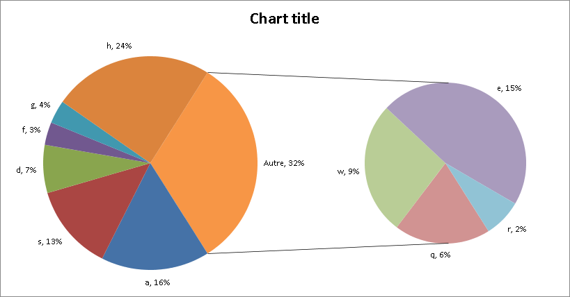

## **Possible Usage Scenarios**
Aspose.Cells APIs have exposed the [GlobalizationSettings](https://reference.aspose.com/cells/java/com.aspose.cells/globalizationsettings) class in order to deal with the scenarios where the user wishes to use custom labels for Subtotals in a spreadsheet. Moreover, the [ChartGlobalizationSettings](https://reference.aspose.com/cells/java/com.aspose.cells/chartglobalizationsettings/) class can also be used to modify the **Other** label for the Pie chart while rendering worksheet or chart.
## **Introduction to GlobalizationSettings Class**
The [GlobalizationSettings](https://reference.aspose.com/cells/java/com.aspose.cells/globalizationsettings) class and [ChartGlobalizationSettings](https://reference.aspose.com/cells/java/com.aspose.cells/chartglobalizationsettings/) class currently offers the following 3 methods which can be overridden in a custom class to get desired labels for the Subtotals or to render custom text for the **Other** label of a Pie chart.

1. [GlobalizationSettings.getTotalName](https://reference.aspose.com/cells/java/com.aspose.cells/globalizationsettings#getTotalName-int-): Gets the total name of the function.
1. [GlobalizationSettings.getGrandTotalName](https://reference.aspose.com/cells/java/com.aspose.cells/globalizationsettings#getGrandTotalName-int-): Gets the grand total name of the function.
1. [ChartGlobalizationSettings.getOtherName](https://reference.aspose.com/cells/java/com.aspose.cells/chartglobalizationsettings/#getOtherName--): Gets the name of "Other" labels for Pie charts.
### **Custom Labels for Subtotals**
The [GlobalizationSettings](https://reference.aspose.com/cells/java/com.aspose.cells/globalizationsettings) class can be used to customize the Subtotal labels by overriding the [GlobalizationSettings.getTotalName](https://reference.aspose.com/cells/java/com.aspose.cells/globalizationsettings#getTotalName-int-) & [GlobalizationSettings.getGrandTotalName](https://reference.aspose.com/cells/java/com.aspose.cells/globalizationsettings#getGrandTotalName-int-) methods as demonstrated ahead.



In order to inject custom labels, it is required to assign the [WorkbookSettings.GlobalizationSettings](https://reference.aspose.com/cells/java/com.aspose.cells/workbooksettings#setGlobalizationSettings-com.aspose.cells.GlobalizationSettings-) property to an instance of the *CustomSettings* class defined above before adding the Subtotals to the worksheet.



{} 

The [GlobalizationSettings](https://reference.aspose.com/cells/java/com.aspose.cells/globalizationsettings) class only works for adding new Subtotals. If a spreadsheet already contains Subtotals, their labels cannot be modified.

{} 
### **Custom Text for Other Label of Pie Chart**
The [ChartGlobalizationSettings](https://reference.aspose.com/cells/java/com.aspose.cells/chartglobalizationsettings/) class offers the [getOtherName](https://reference.aspose.com/cells/java/com.aspose.cells/chartglobalizationsettings/#getOtherName--) method which is useful to give the "Other" label of Pie charts a custom value. The following snippet defines a custom class and overrides the [getOtherName](https://reference.aspose.com/cells/java/com.aspose.cells/chartglobalizationsettings/#getOtherName--) method to get a custom label based on default language set for JVM.



The following snippet loads an existing spreadsheet containing a Pie chart and renders the chart to an image while utilizing the *GlobalCustomSettings* class created above.



Following is the resultant image when locale of the machine is set to France. As you can see that the label "Other" has been translated to "Autre" as defined in *GlobalCustomSettings* class.


