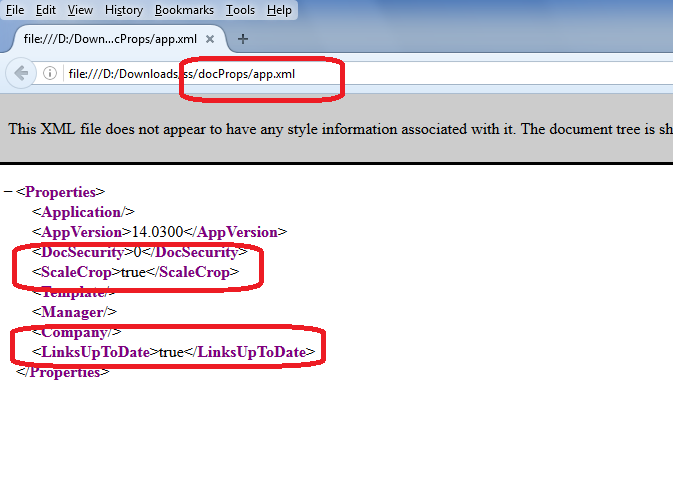

## **Possible Usage Scenarios**
[ScaleCrop](https://reference.aspose.com/cells/java/com.aspose.cells/builtindocumentpropertycollection#setScaleCrop-boolean-) and [LinksUpToDate](https://reference.aspose.com/cells/java/com.aspose.cells/builtindocumentpropertycollection#setLinksUpToDate-boolean-) are two extended built-in document properties defined inside the OpenXml format. The purpose of these properties are following
## **1) ScaleCrop**
This element indicates the display mode of the document thumbnail. Set this element to **true** to enable scaling of the document thumbnail to the display. Set this element to **false** to enable cropping of the document thumbnail to show only sections that fit the display.

The possible values for this element are defined by the W3C XML Schema boolean datatype.
## **2) LinksUpToDate**
This element indicates whether hyperlinks in a document are up-to-date. Set this element to **true** to indicate that hyperlinks are updated. Set this element to **false** to indicate that hyperlinks are outdated.

The possible values for this element are defined by the W3C XML Schema boolean datatype.
## **Screenshot showing these properties inside the app.xml file**

## **Setting ScaleCrop and LinksUpToDate properties of Built-In Document Properties**
The following sample code sets the [ScaleCrop](https://reference.aspose.com/cells/java/com.aspose.cells/builtindocumentpropertycollection#setScaleCrop-boolean-) and [LinksUpToDate](https://reference.aspose.com/cells/java/com.aspose.cells/builtindocumentpropertycollection#setLinksUpToDate-boolean-) extended built-in document properties of the workbook. Please check the [output excel file](5472494.xlsx) generated with this code, change its extension to .zip and extract its contents and view the aap.xml as shown in the screenshot above.



