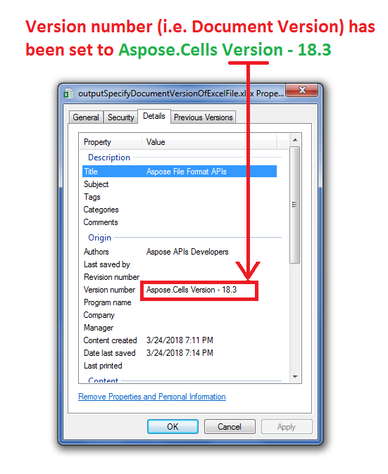

## **Possible Usage Scenarios**

You can change the *Version number* of Excel file by right-clicking the file and then selecting *Properties > Details* and then editing the *Version number* field. Please use [**BuiltInDocumentPropertyCollection.DocumentVersion**](https://reference.aspose.com/cells/java/com.aspose.cells/builtindocumentpropertycollection#DocumentVersion) property to change it programmatically using Aspose.Cells APIs.

## **Specify Document Version of the Excel File using BuiltIn Document Properties**

The following sample code creates a workbook and changes its built-in document properties that include *Title*, *Authors* and *Version number*. Please see the [output Excel file](64716836.xlsx) generated by the code and screenshot that shows the modified *Version number* by [**BuiltInDocumentPropertyCollection.DocumentVersion**](https://reference.aspose.com/cells/java/com.aspose.cells/builtindocumentpropertycollection#DocumentVersion) property.

## **Sample Code**



