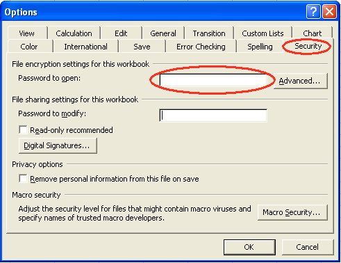

{}
Microsoft Excel (97–365) enables you to encrypt/password‑protect your spreadsheets. It utilizes algorithms provided by a Crypto Service Provider. A Crypto Service Provider (CSP) is a set of cryptographic algorithms with different properties. The default CSP is **"Office 97/2000 Compatible"** or **"Weak Encryption (XOR)"**. It’s also important to choose a proper encryption key length. Some Crypto Service Providers don’t support more than 40 or 56 bits; that is considered a weak encryption type. However, for strong encryption, a minimum key length of 128 bits is required. Microsoft Windows contains Crypto Service Providers that offer strong encryption types as well, for example, the **Microsoft Strong Cryptographic Provider**. To give an idea, 128‑bit encryption is what banks use to secure connections with their Internet banking systems. Aspose.Cells allows you to encrypt/password‑protect your Excel files with your desired encryption type.
{}

## **Using MS Excel**

In MS Excel (e.g., MS Excel 2003), to implement file‑encryption settings, you may try:

- From the **Tools** menu, select **Options**, and then select the **Security** tab.  
- Input **Password to open** and click the **Advanced** button.  
- Choose the encryption type and confirm the password.

**Figure: Options dialog**

**Figure: Encryption Type dialog**

## **Encrypting Excel file**

The following example shows how you can encrypt/password‑protect an Excel file using the Aspose.Cells API.

### **Sample Code:**



## **Decrypting Excel file with Aspose.Cells**

It is very easy to open a password‑protected Excel file and decrypt it using the Aspose.Cells API, as shown in the following code:




