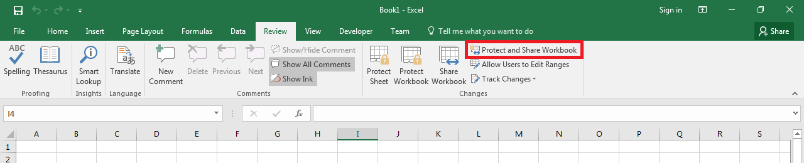

---  
title: Password Protect or Unprotect the Shared Workbook  
linktitle: Protect or Unprotect Shared Workbook  
type: docs  
weight: 70  
url: /java/password-protect-or-unprotect-the-shared-workbook/  
ai_search_scope: cells_java
ai_search_endpoint: "https://docsearch.api.aspose.cloud/ask"
---  

## **Possible Usage Scenarios**

You can protect or unprotect the shared workbook using Microsoft Excel, as shown in the following screenshot. Aspose.Cells also supports this feature with the **Workbook.protectSharedWorkbook()** and **Workbook.unprotectSharedWorkbook()** methods.  

  

## **Password Protect or Unprotect the Shared Workbook**

The following sample code creates a workbook, protects it while enabling sharing, and saves it as the output Excel file. The screenshot shows that when you try to unprotect it, Microsoft Excel prompts you to enter the password.  

  

## **Sample Code**

  

