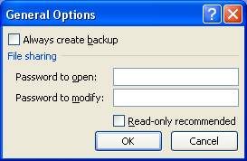

{}

You can assign a **Password to open** and a **Password to modify** while creating your workbooks in Microsoft Excel. Please see this screenshot which shows the interface Microsoft Excel provides to specify these passwords.

Sometimes, you need to check if the given password matches the **Password to modify** programmatically. Aspose.Cells provides the [**workbook.getSettings().getWriteProtection().validatePassword()**](https://reference.aspose.com/cells/java/com.aspose.cells/writeprotection#validatePassword-java.lang.String-) method, which you can use to check whether the given password to modify is correct.

{}

## Java code to check Password to modify using Aspose.Cells

The following sample code loads the [source Excel](5473057.xlsx) file. It has a password to open as *1234* and a password to modify as *5678*. The code first checks if *567* is the correct password to modify and it returns **false**, and then it checks if *5678* is the password to modify, which returns **true**.



## Console Output generated by the Java code

This is the console output of the above sample code after loading the [source Excel](5473057.xlsx) file.



Is 567 the correct password to modify: false

Is 5678 the correct password to modify: true



