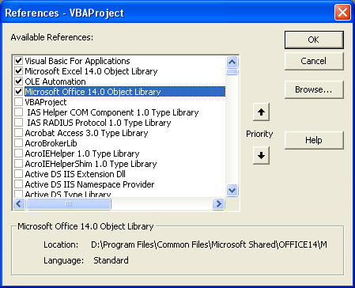

{}

In Microsoft Excel, you can add a library reference to the VBA project by clicking the **Tools > References...** manually. It will open the following dialog box which will help you to select from existing references or browse your library yourself.

But sometimes, you need to add or register the library reference to the VBA project through code. You can do it using Aspose.Cells [**VbaProject.getReferences().addRegisteredReference()**](https://reference.aspose.com/cells/java/com.aspose.cells/vbaprojectreferencecollection#addRegisteredReference(java.lang.String,%20java.lang.String)) method.

{}

## **How to Add a library reference to VBA project in workbook**

The following sample code adds or registers two library references to the VBA project of the workbook using [**VbaProject.getReferences().addRegisteredReference()**](https://reference.aspose.com/cells/java/com.aspose.cells/vbaprojectreferencecollection#addRegisteredReference(java.lang.String,%20java.lang.String)) method.


