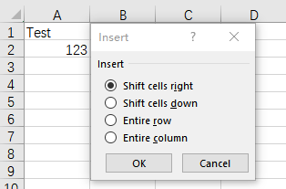

## **Introduction**

In Excel, you can select a range, then insert a range and shift other data right or down.

****

## **Insert Ranges Using Aspose.Cells**

Aspose.Cells provides [Cells.InsertRange](https://reference.aspose.com/cells/java/com.aspose.cells/cells#insertRange-com.aspose.cells.CellArea-int-) method to insert a range.

## **Insert Ranges And Shift Cells Right**

Insert a range and shift cells right as follows using Aspose.Cells:



## **Insert Ranges And Shift Cells Down**

Insert a range and shift cells down as follows using Aspose.Cells:




