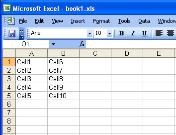

{} 

This article shows how to move a range of cells in a worksheet.

{} 
## **Move a Range of Cells in a Worksheet**
The example code uses a template file to demonstrate the task.

**The input file:** 

Please see the following generated file with range A1:B5 moved to C1:D5.

**The output file:** 



