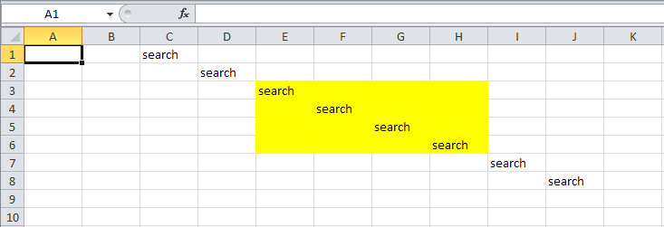
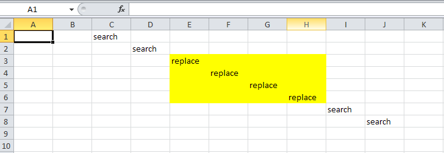

{}

Sometimes, you need to search for and replace specific data in a range, ignoring any cell values outside the desired range. Aspose.Cells allows you to limit a search to a specific range. This article explains how.

{}

Aspose.Cells provides the [**FindOptions.setRange()**](https://reference.aspose.com/cells/java/com.aspose.cells/findoptions#setRange-com.aspose.cells.CellArea-) method for specifying a range when searching for data.

Suppose you want to search for the string **"search"** and replace it with **"replace"** in the range **E3:H6**. In the screenshot below, the string "search" can be seen in several cells, but we want to replace it only in a given range, **which is highlighted in yellow**.

**Input file**

After the execution of the code, the output file looks **as shown below**. All "search" strings within the range have been replaced with "replace".

**Output file**



## Related Articles

- [Find or Search Data](/cells/java/find-or-search-data/)

