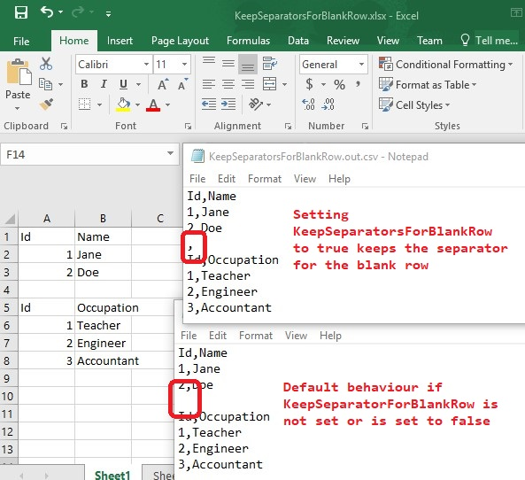

## **Keep Separators for Blank Rows while exporting spreadsheets to CSV format**

Aspose.Cells provides the ability to keep line separators while converting spreadsheets to CSV format. For this, You may use the [**KeepSeparatorsForBlankRow**](https://reference.aspose.com/cells/java/com.aspose.cells/txtsaveoptions#KeepSeparatorsForBlankRow) property of [**TxtSaveOptions**](https://reference.aspose.com/cells/java/com.aspose.cells/TxtSaveOptions) class. [**KeepSeparatorsForBlankRow**](https://reference.aspose.com/cells/java/com.aspose.cells/txtsaveoptions#KeepSeparatorsForBlankRow) is a boolean property. To keep the separators for blank lines while converting the Excel File to CSV, set the [**KeepSeparatorsForBlankRow**](https://reference.aspose.com/cells/java/com.aspose.cells/txtsaveoptions#KeepSeparatorsForBlankRow) property to **true**.

The following sample code loads the [source Excel file](KeepSeparatorsForBlankRow.xlsx). It sets [**TxtSaveOptions.KeepSeparatorsForBlankRow**](https://reference.aspose.com/cells/java/com.aspose.cells/txtsaveoptions#KeepSeparatorsForBlankRow) property to **true** and saves it as [KeepSeparatorsForBlankRow.out.csv](KeepSeparatorsForBlankRow.out.csv). The screenshot shows the comparison between the source Excel file, the default output generated while converting the spreadsheet to CSV and the output generated by setting [**KeepSeparatorsForBlankRow**](https://reference.aspose.com/cells/java/com.aspose.cells/txtsaveoptions#KeepSeparatorsForBlankRow) to **true**.

## **Sample Code**


