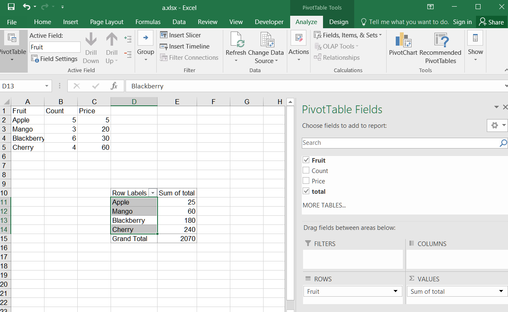

## **Possible Usage Scenarios**
When you create a pivot table based on existing data, you may find that the data in it is not exactly what you need. The desired data may be a combination of the original data. For example, you might need to add, subtract, multiply, or divide the original data before using it. At this point, you need to create a calculated field and set the appropriate formula for calculation. Then you can perform statistical and other operations on the calculated field. 

## **Add calculated field in Pivot Table in Excel**
Insert a calculated field in a PivotTable in Excel, follow these steps:

1. Select the PivotTable that you want to add a calculated field to. 
2. Go to the PivotTable Analyze tab on the ribbon.
3. Click on "Fields, Items, & Sets" and then select "Calculated Field" from the drop‑down menu.
4. In the "Name" field, enter a name for the calculated field.
5. In the "Formula" field, enter the formula you want to perform using the appropriate PivotTable field names and mathematical operators. 
 

6. Click **OK** to create the calculated field.
7. The new calculated field will appear in the PivotTable Field List under the Values section.
8. Drag the calculated field to the Values section of the PivotTable to display the calculated values.
 

## **Add calculated field in Pivot Table**
Please see the following sample code. The code first sets the original data and creates a pivot table. Then it creates the calculated field based on the existing PivotField in the pivot table and adds the calculated field to the data area. Finally, it saves the workbook in [output XLSX](out.xlsx) format. After executing the example code, a pivot table with a calculated field is added to the worksheet.

## **Sample Code**


