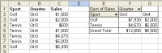

## **Create Pivot Table**

### **Create Pivot Table Using Aspose.Cells**

{}

With Aspose.Cells, it is possible to add pivot tables to spreadsheets. Aspose.Cells has a number of special classes used specifically to create and control pivot tables. These classes are used to create and set the properties of a [**PivotTable**](https://reference.aspose.com/cells/java/com.aspose.cells/PivotTable) object, used as the pivot table building blocks.

The pivot table objects are:

- [**PivotField**](https://reference.aspose.com/cells/java/com.aspose.cells/PivotField): it represents a field in a pivot table.
- [**PivotFieldCollection**](https://reference.aspose.com/cells/java/com.aspose.cells/PivotFieldCollection): it represents a collection of all the [**PivotField**](https://reference.aspose.com/cells/java/com.aspose.cells/PivotField) objects in the pivot table.
- [**PivotTable**](https://reference.aspose.com/cells/java/com.aspose.cells/PivotTable): it represents a pivot table.
- [**PivotTableCollection**](https://reference.aspose.com/cells/java/com.aspose.cells/PivotTableCollection): it represents the collection of all the pivot table objects on the worksheet.

{}

### **Creating a Simple Pivot Table**

To create a pivot table using Aspose.Cells, please follow the steps below:

1. Add some data to worksheet cells by using the [**Cell**](https://reference.aspose.com/cells/java/com.aspose.cells/cell) object's [**setValue**](https://reference.aspose.com/cells/java/com.aspose.cells/cell#Value) method. This data will be used as a data source for the pivot table.
1. Add a pivot table to the worksheet by calling the [**add**](https://reference.aspose.com/cells/java/com.aspose.cells/pivottablecollection#add-com.aspose.cells.PivotTable-int-int-java.lang.String-) method of the [**PivotTableCollection**](https://reference.aspose.com/cells/java/com.aspose.cells/PivotTableCollection) class, encapsulated in the [**Worksheet**](https://reference.aspose.com/cells/java/com.aspose.cells/Worksheet) object.
1. Access the [**PivotTable**](https://reference.aspose.com/cells/java/com.aspose.cells/PivotTable) object from the [**PivotTableCollection**](https://reference.aspose.com/cells/java/com.aspose.cells/PivotTableCollection) by passing the [**PivotTable**](https://reference.aspose.com/cells/java/com.aspose.cells/PivotTable) index.
1. Use any of the pivot table objects (explained above) encapsulated in the [**PivotTable**](https://reference.aspose.com/cells/java/com.aspose.cells/PivotTable) object to manage the pivot table.

{}

When assigning a range of cells as the data source, the range must be set from the top left to the bottom right. For example, "A1:C3" is valid; "C3:A1" is invalid.

{}

The code example below shows how to create a simple pivot table following the basic steps listed above. When executing the code, a pivot table is added to the worksheet:

**Creating a pivot table based on a corresponding field**



