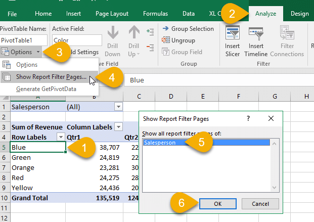

## **Show report filter pages option**

Excel supports creating pivot tables, adding report filters, and enables the "Show Report Filter Pages" option. Aspose.Cells also supports this feature to enable the "Show Report Filter Pages" option on the created pivot table. The following is the screen showing the option in Excel.

As a result of this option, the created workbook contains more worksheets. It splits each possible value of the report filter into a separate worksheet. In this example, it has a filter on "Position" and the data has three distinct positions (A, B, C). This feature adds three additional worksheets named A, B, C, which are the same pivot table but with the preselected option A, B, and C.

The sample file and output file can be downloaded from the following links:

[samplePivotTable.xlsx](81920917.xlsx)

[outputSamplePivotTable.xls](81920918.xlsx)

## Source Code



