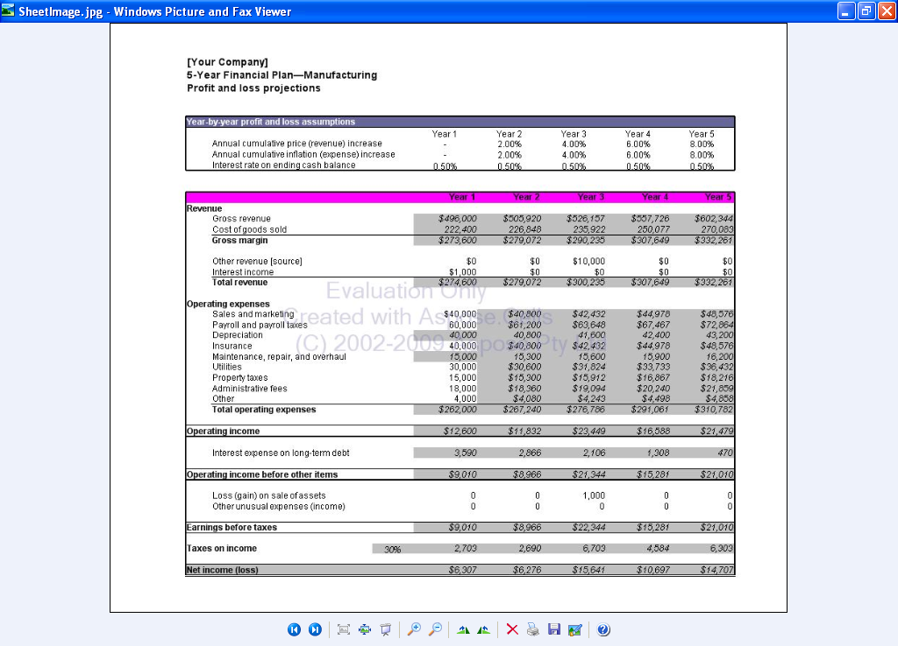
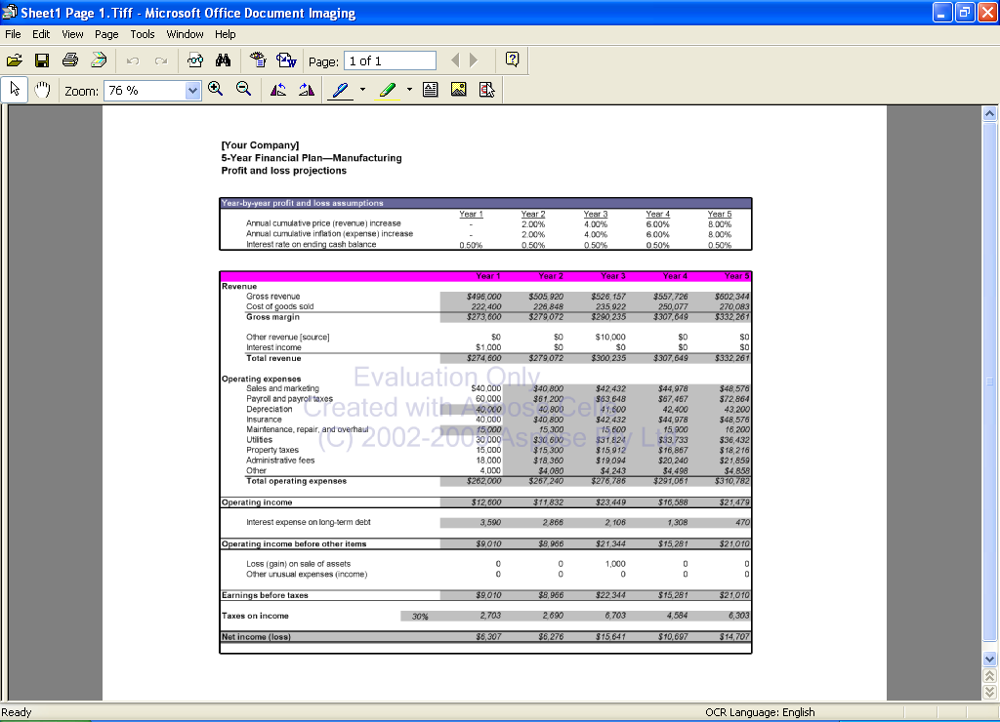
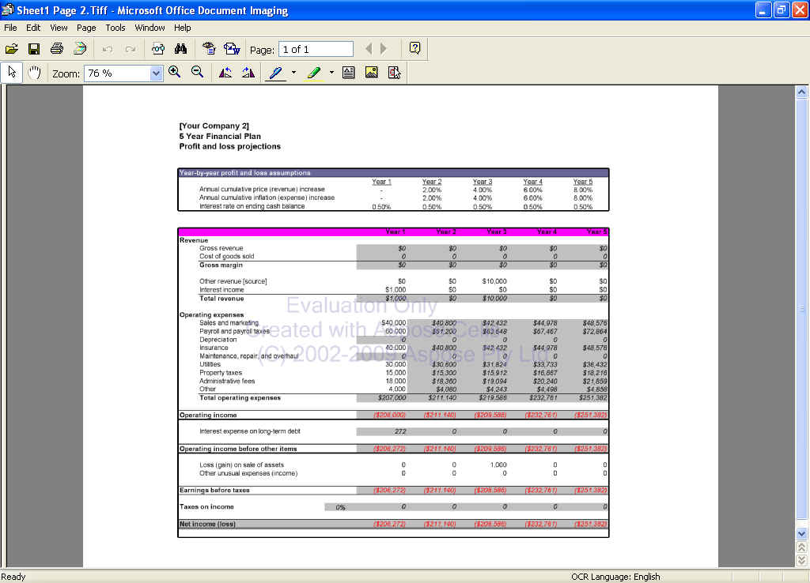

{}

This document is designed to provide the developers with a detailed understanding of how to convert a worksheet to an image file & worksheet with multiple pages to an image file per page.

Sometimes, you might need to present worksheets as images, for example, to use them in applications or web pages. You might need to insert the images into a Word document, a PDF file, a PowerPoint presentation, or use them in some other scenario. Simply, you want to render the worksheet as an image. Aspose.Cells APIs support converting worksheets in Microsoft Excel files to images. Also, Aspose.Cells supports converting a workbook to multiple image files, one per page.

{}

## **Using Aspose.Cells to Convert Worksheet to Image File**

This article shows how to use Aspose.Cells for Java API to convert a worksheet to image. The API provides several valuable classes, such as [**SheetRender**](https://reference.aspose.com/cells/java/com.aspose.cells/SheetRender), [**ImageOrPrintOptions**](https://reference.aspose.com/cells/java/com.aspose.cells/ImageOrPrintOptions), [**WorkbookRender**](https://reference.aspose.com/cells/java/com.aspose.cells/WorkbookRender), and so on. The [**SheetRender**](https://reference.aspose.com/cells/java/com.aspose.cells/SheetRender) class represents a worksheet to render images for the worksheet and has an overloaded [**toImage**](https://reference.aspose.com/cells/java/com.aspose.cells/sheetrender#toImage-int-java.io.OutputStream-) method that can convert a worksheet to image files directly with any attributes or options set.



### **Result**

After executing the above code, the worksheet named Sheet1 is converted into an image file SheetImage.jpg.

**The output JPG**

## **Using Aspose.Cells to Convert Worksheet to Image File by Page**

This example shows how to use Aspose.Cells to convert a worksheet from a template workbook that has several pages to one image file per page.



### **Result**

After executing the above code, the worksheet named Sheet1 is converted into two image files (1 per page) Sheet 1 Page 1.Tiff and Sheet 1 Page 2.Tiff.

**Generated image file (Sheet 1 Page 1.Tiff)**

**Generated image file (Sheet 1 Page 2.Tiff)**

{}

This article shows how to convert a worksheet to an image file and convert worksheets with multiple pages to multiple image files (one per page) using Aspose.Cells. Aspose.Cells offers more flexibility than other components and provides outstanding speed, efficiency, and reliability. The results show that Aspose.Cells has benefited from years of research, design, and careful tuning.

{}

## Related Articles

- [Converting Worksheet to Different Image Formats](/cells/java/converting-worksheet-to-different-image-formats/)
- [Export Worksheet or Chart into Image with Desired Width and Height](/cells/java/export-worksheet-or-chart-into-image-with-desired-width-and-height/)

