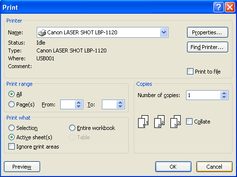

{}

This document is designed to provide developers with an understanding (in a compact manner) of how to print spreadsheets.

{}

## Usage Scenario

After you finish creating your spreadsheet, you will probably want to print a hard copy of the sheet for your needs. When you are printing, MS Excel assumes you want to print the entire worksheet area unless you specify your selection. The following screenshot shows the dialog box for printing a workbook with Excel.

**Figure:** Print Dialog Box

## Printing Workbooks using Aspose.Cells

Aspose.Cells for Java provides a **toPrinter** method of the **SheetRender** class. By using the **SheetRender.toPrinter** method, you can provide the printer name as well as the print job name.

## Sample Code

### Print Selected Worksheet

The following code snippet demonstrates the use of the **SheetRender.toPrinter** method to print your selected worksheet.



### Print Whole Workbook

You can also use the **WorkbookRender.toPrinter** method to print the whole workbook. The following code snippet demonstrates the use of the **WorkbookRender.toPrinter** method to print the whole workbook.



## Related Articles

- [Specify Job or Document Name while printing with Aspose.Cells](/cells/java/specify-job-or-document-name-while-printing-with-aspose-cells/)

