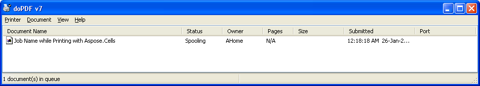

{}

You can specify job or document name while printing your workbook or worksheet using the **WorkbookRender** or **SheetRender** objects. Aspose.Cells provides the **WorkbookRender.toPrinter(printerName, jobName)** and **SheetRender.toPrinter(printerName, jobName)** methods that you can use to specify a job name while printing your workbook or worksheet.

{}

## **Specify Job or Document Name while printing with Aspose.Cells**

The sample code loads the source Excel file and then sends it to the printer by specifying the job or document name using the **WorkbookRender.toPrinter(printerName, jobName)** and **SheetRender.toPrinter(printerName, jobName)** methods. The screenshot shows how the job name looks in the printer queue.



## Related Articles

- [Printing Workbooks](/cells/java/printing-workbooks/)

