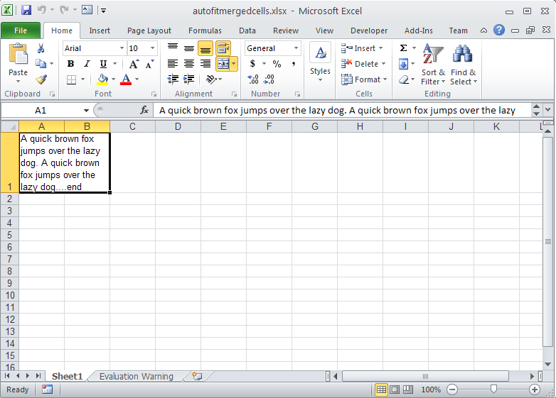

{}

Microsoft Excel provides a feature that allows you to auto‑size the height of a cell according to its content. The feature is called AutoFit rows. Microsoft Excel does not support AutoFit on merged cells natively. Sometimes the feature becomes vital for a user who really needs to implement AutoFit rows on merged cells as well.

{}

Aspose.Cells supports this feature through the [**AutoFitterOptions**](https://reference.aspose.com/cells/java/com.aspose.cells/AutoFitterOptions) API. Using this API, it is possible to AutoFit rows in a worksheet, including merged cells.

After executing the code, Aspose.Cells AutoFits rows for merged cells.

**Output Excel file**



## Related Articles

- [Autofit Rows and Columns](/cells/java/autofit-rows-and-columns/)
- [Adjusting Row Height and Column Width](/cells/java/adjusting-row-height-and-column-width/)

