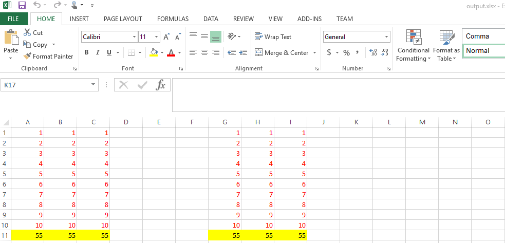

## **Introduction**
Sometimes, you need to copy rows and columns in a worksheet without copying the entire worksheet. With Aspose.Cells, it is possible to copy rows and columns within or between workbooks.

When a row (or column) is copied, the data contained in it, including formulas - with updated references - and values, comments, formatting, hidden cells, images, and other drawing objects are copied too.
## **Copying Rows and Columns with Microsoft Excel**
1. Select the row or column that you want to copy.
1. To copy rows or columns, click **Copy** on the **Standard** toolbar, or press **CTRL**+**C**.
1. Select a row or column below or to the right of where you want to copy your selection.
1. When you are copying rows or columns, click **Copied Cells** on the **Insert** menu.

{} 

If you click **Paste** on the **Standard** toolbar or press **CTRL**+**V** instead of clicking a command on the **Insert** menu, any contents of the destination cells are replaced.

{} 

## **Copying Single Row**

Aspose.Cells provides the [copyRow](https://reference.aspose.com/cells/java/com.aspose.cells/cells#copyRow\(com.aspose.cells.Cells,%20int,%20int\)) method of the [Cells](https://reference.aspose.com/cells/java/com.aspose.cells/Cells) class. This method copies all types of data including formulas, values, comments, cell formats, hidden cells, images and other drawing objects from the source row to the destination row.

The [copyRow](https://reference.aspose.com/cells/java/com.aspose.cells/cells#copyRow\(com.aspose.cells.Cells,%20int,%20int\)) method takes the following parameters:

- the source [Cells](https://reference.aspose.com/cells/java/com.aspose.cells/Cells) object,
- the source row index, and
- the destination row index.

Use this method to copy a row within a sheet, or to another sheet. The [copyRow](https://reference.aspose.com/cells/java/com.aspose.cells/cells#copyRow\(com.aspose.cells.Cells,%20int,%20int\)) method works in a similar way to Microsoft Excel. So, for example, you don't need to set the height of the destination row explicitly, that value is copied too.

The following example shows how to copy a row in a worksheet. It uses a template Microsoft Excel file and copies the second row (complete with data, formatting, comments, images and so on) and paste it to the 12th row in the same worksheet.



The following output is generated when the code below is executed.

**The row is copied with the highest degree of precision and accuracy** 

{} 

When copying rows, it is important to note related images, charts or other drawing objects as this is the same with Microsoft Excel:

1. If the source row index is 5, the image, chart, etc., is copied if it is contained in the three rows (the starting row index is 4 and the ending row index is 6).
1. The existing images, charts, etc. in the destination row will not be removed.

{} 

## **Copying Multiple Rows**

You can also copy multiple rows onto a new destination while using the [**Cells.copyRows**](https://reference.aspose.com/cells/java/com.aspose.cells/cells#copyRow(com.aspose.cells.Cells,%20int,%20int)) method which takes an additional parameter of type integer to specify the number of source rows to be copied.

Below is a snapshot of the input spreadsheet containing 3 rows of data whereas the code snippet provided below copies all 3 rows to a new location starting from 7th row.



Here is the resultant spreadsheet view after executing the above code snippet.

## **Copying Single Column**

Aspose.Cells provides the [copyColumn](https://reference.aspose.com/cells/java/com.aspose.cells/cells#copyColumn\(com.aspose.cells.Cells,%20int,%20int\)) method of the [Cells](https://reference.aspose.com/cells/java/com.aspose.cells/Cells) class, this method copies all types of data, including formulas - with updated references - and values, comments, cell formats, hidden cells, images and other drawing objects from the source column to the destination column.

The [copyColumn](https://reference.aspose.com/cells/java/com.aspose.cells/cells#copyColumn\(com.aspose.cells.Cells,%20int,%20int\)) method takes the following parameters:

- the source [Cells](https://reference.aspose.com/cells/java/com.aspose.cells/Cells) object,
- source column index, and
- the destination column index.

Use the [copyColumn](https://reference.aspose.com/cells/java/com.aspose.cells/cells#copyColumn\(com.aspose.cells.Cells,%20int,%20int\)) method to copy a column within a sheet or to another sheet.

This example copies a column from a worksheet and pastes it into a worksheet in another workbook.

**A column is copied from one workbook to another** 



## **Copying Multiple Columns**

Similar to [**Cells.copyRows**](https://reference.aspose.com/cells/java/com.aspose.cells/cells#copyRow(com.aspose.cells.Cells,%20int,%20int)) method, the Aspose.Cells APIs also provide the [**Cells.copyColumns**](https://reference.aspose.com/cells/java/com.aspose.cells/cells#copyColumns(com.aspose.cells.Cells,%20int,%20int,%20int)) method in order to copy multiple source columns to a new location.



Here is how source and resultant spreadsheets look in Excel.

## **Pasting Rows/Columns with Paste Options**
Aspose.Cells now provides [PasteOptions](https://reference.aspose.com/cells/java/com.aspose.cells/PasteOptions) while using functions [CopyRows](https://reference.aspose.com/cells/java/com.aspose.cells/cells#copyRows\(com.aspose.cells.Cells,%20int,%20int,%20int,%20com.aspose.cells.CopyOptions,%20com.aspose.cells.PasteOptions\)) and [CopyColumns](https://reference.aspose.com/cells/java/com.aspose.cells/cells#copyColumns\(com.aspose.cells.Cells,%20int,%20int,%20int,%20com.aspose.cells.PasteOptions\)). It allows setting appropriate paste options similar to Excel.



