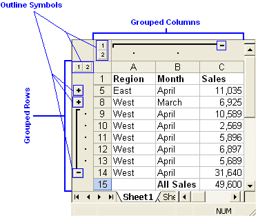
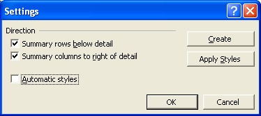

## **Introduction**
In a Microsoft Excel file, you can create an outline for the data to let you show and hide levels of detail with a single mouse click.

Click the **Outline Symbols**, 1,2,3, + and - to quickly display only the rows or columns that provide summaries or headings for sections in a worksheet, or you can use the symbols to see details under an individual summary or heading as shown below in the figure:

Grouping of rows & columns 

## **Group Management of Rows & Columns**
Aspose.Cells provides a class, [Workbook](https://reference.aspose.com/cells/java/com.aspose.cells/workbook) that represents a Microsoft Excel file. The [Workbook](https://reference.aspose.com/cells/java/com.aspose.cells/workbook) class contains a [Worksheets](https://reference.aspose.com/cells/java/com.aspose.cells/WorksheetCollection) collection that allows access to each worksheet in the Excel file. A worksheet is represented by the [Worksheet](https://reference.aspose.com/cells/java/com.aspose.cells/Worksheet) class. The [Worksheet](https://reference.aspose.com/cells/java/com.aspose.cells/Worksheet) class provides a [Cells](https://reference.aspose.com/cells/java/com.aspose.cells/Cells) collection that represents all cells in the worksheet.

The [Cells](https://reference.aspose.com/cells/java/com.aspose.cells/Cells) collection provides several methods to manage rows or columns in a worksheet, few of these are discussed below in more detail.
### **Grouping Rows & Columns**
It is possible to group rows or columns by calling the [groupRows](https://reference.aspose.com/cells/java/com.aspose.cells/cells#groupRows\(int,%20int,%20boolean\)) and [groupColumns](https://reference.aspose.com/cells/java/com.aspose.cells/cells#groupColumns\(int,%20int,%20boolean\)) methods of the [Cells](https://reference.aspose.com/cells/java/com.aspose.cells/Cells) collection. Both methods take the following parameters:

- First row/column index, the first row or column in the group.
- Last row/column index, the last row or column in the group.
- Is hidden, a Boolean parameter that specifies whether to hide rows/columns after grouping or not.


## **Group Settings**
Microsoft Excel also allows to configure group settings for displaying:

- Summary rows below detail.
- Summary columns to right of detail.

**Group settings** 

It is possible to configure these group settings using the Worksheet class' Outline property.
### **Summary Rows Below Detail**
Developers can control displaying summary rows below detail by using the [Outline](https://reference.aspose.com/cells/java/com.aspose.cells/Outline) class' [SummaryRowBelow](https://reference.aspose.com/cells/java/com.aspose.cells/outline#SummaryRowBelow) method.


### **Summary Columns to Right of Detail**
It is possible to control whether summary columns are displayed to the right of the details with the [Outline](https://reference.aspose.com/cells/java/com.aspose.cells/Outline) class' [SummaryColumnRight](https://reference.aspose.com/cells/java/com.aspose.cells/outline#SummaryColumnRight) method.


### **Ungrouping Rows & Columns**
Ungroup grouped rows or columns by calling the [Cells](https://reference.aspose.com/cells/java/com.aspose.cells/Cells) collection's [UngroupRows](https://reference.aspose.com/cells/java/com.aspose.cells/cells#ungroupRows\(int,%20int\)) and [UngroupColumns](https://reference.aspose.com/cells/java/com.aspose.cells/cells#ungroupColumns\(int,%20int\)) methods. Both methods take the same parameters:

- First row or column index, the first row/column to be ungrouped.
- Last row or column index, the last row/column to be ungrouped.


