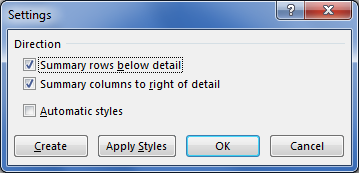
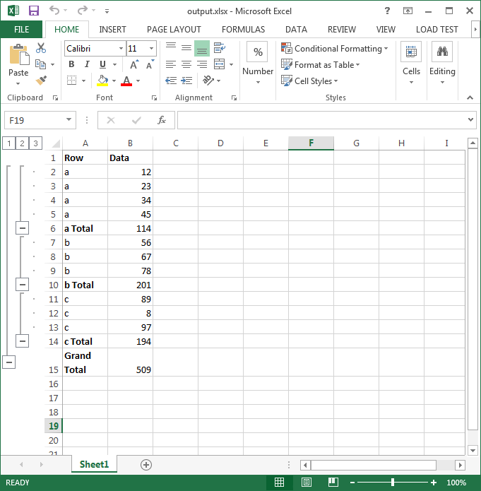

{}

This article will explain how to apply Subtotal to data and changing the direction of Outline Summary Rows below Detail.

You can apply Subtotal to data using [**Worksheet.Cells.subtotal()**](https://reference.aspose.com/cells/java/com.aspose.cells/cells#subtotal-com.aspose.cells.CellArea-int-int-int[]-) method. It takes the following parameters.

- **CellArea** - The range to apply subtotal on
- **GroupBy** - The field to group by, as a zero-based integer offset
- **Function** - The subtotal function.
- **TotalList** - An array of zero-based field offsets, indicating the fields to which the subtotals are added.
- **Replace** - Indicates whether replace the current subtotals
- **PageBreaks** - Indicates whether add a page break between groups
- **SummaryBelowData** - Indicates whether add summary below data.

Also, you can control the direction of Outline **Summary rows below detail** as shown in the following screenshot using [**Worksheet.getOutline().SummaryRowBelow**](https://reference.aspose.com/cells/java/com.aspose.cells/outline#SummaryRowBelow) property. You can open this setting in Microsoft Excel using **Data > Outline > Settings**

{}

## Example

### Screenshots comparing source and output files

The following screenshot shows the source Excel file used in the sample code below which contains some data in columns A and B.

The following screenshot shows the output Excel file generated by the sample code. As you can see, subtotal has been applied to range **A2:B11** and the direction of the outline is summary rows below detail.

### Java code to apply subtotal and change direction of outline summary rows below detail

Here is the sample code to achieve the output as shown above.


