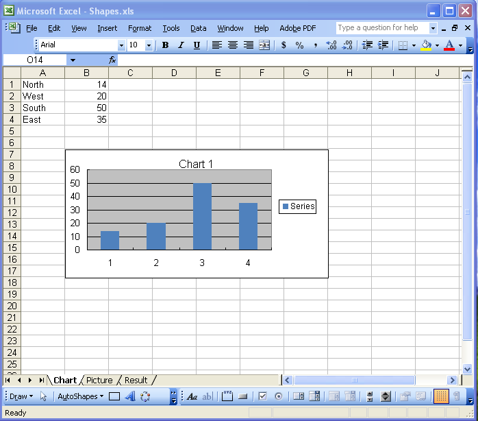
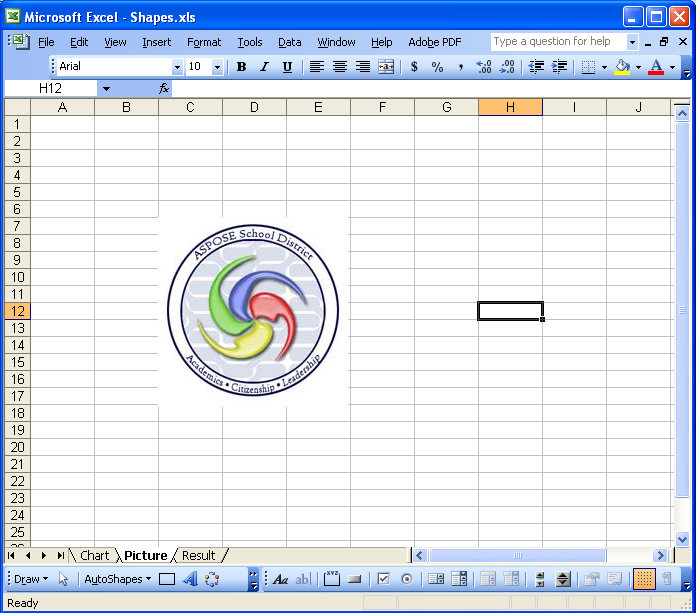
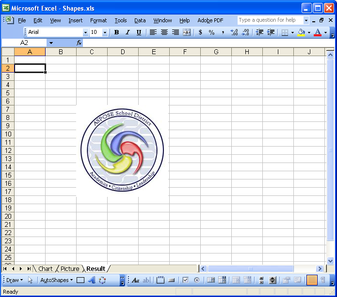
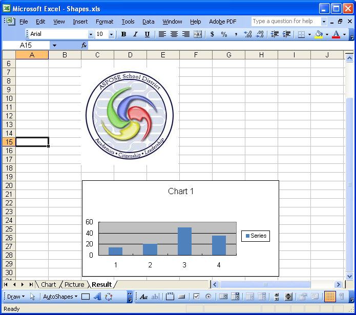
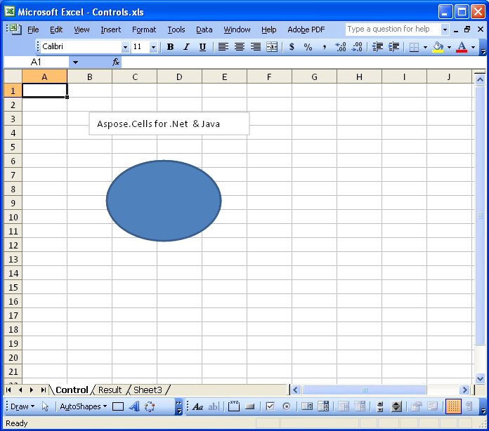
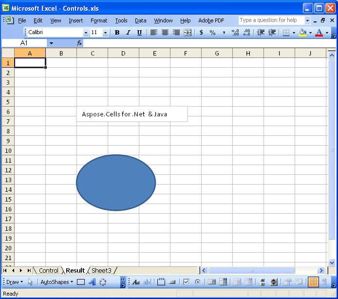

{}

Sometimes you need to copy different pictures, charts, and other drawing objects to different worksheets as per your requirement. Aspose.Cells supports copying shapes between worksheets. The charts, images, and other objects are copied with the highest degree of precision.

You might try Office Automation, but that has its own drawbacks. There are several reasons and issues involved: for example, security, stability, scalability, speed, price, and features. In short, there are many reasons, with the top one being that Microsoft strongly recommends against Office automation from software solutions.

In this article, we create a console application and perform the copying of pictures, charts, and other drawing objects between worksheets of a workbook with a few simple lines of code using Aspose.Cells.

This document is designed to provide developers with a detailed understanding of how to copy shapes (pictures, charts, controls, and other drawing objects) between worksheets.

{}

## **Copying Shapes**

This article explains how to:

- [Copy a picture from one worksheet to another](/cells/java/copy-shapes-between-worksheets/#copying-a-picture-from-one-worksheet-to-another).
- [Copy a chart from one worksheet to another](/cells/java/copy-shapes-between-worksheets/#task-2-copying-a-chart-from-one-worksheet-to-another).
- [Copy controls and other drawing objects from one worksheet to another](/cells/java/copy-shapes-between-worksheets/#task-3-copying-controls-and-other-drawing-objects-from-one-worksheet-to-another).

### **Copying a Picture from One Worksheet to Another**

#### **Step 1: Creating a Workbook with Picture and Chart in Microsoft Excel**

1. Create a new workbook in Microsoft Excel.  
2. Add a picture on the first worksheet and a chart on the second worksheet.

   The following screenshots show the two template worksheets created in Microsoft Excel.

   **Worksheet “Chart” with chart**

   

   **Worksheet “Picture” with picture**

   

   Now copy the picture in the worksheet named “Picture” to the last worksheet “Result”.

#### **Step 2: Download Aspose.Cells.zip**

1. [Download Aspose.Cells for Java](https://downloads.aspose.com/cells/java).  
2. Unzip it on your development computer.

   All [Aspose](http://www.aspose.com/) components, when installed, work in evaluation mode. The evaluation mode has no time limit and it only injects watermarks into produced documents.

#### **Step 3: Create a Project**

You can either create a project using a Java IDE, such as Eclipse, or create a simple program using Notepad.

#### **Step 4: Add Class Path**

To set the class path using Eclipse, please perform the following steps:

1. Extract **Aspose.Cells.jar** and **dom4j_1.6.1.jar** from **Aspose.Cells.zip**.  
2. Set the classpath of the project in Eclipse:  
   - Select your project in Eclipse and then click **Project → Properties**.  
   - Select **Java Build Path** on the left side of the dialog, then choose the **Libraries** tab, click **Add JARs** or **Add External JARs**, select **Aspose.Cells.jar** and **dom4j_1.6.1.jar**, and add them to the build path.  
   - Write an application to invoke the APIs of Aspose's components.

Or you may set it at runtime from the Windows command prompt. For example:

```bat
javac -classpath %classpath%;e:\Aspose.Cells.jar; ClassName.java
java -classpath %classpath%;e:\Aspose.Cells.jar; ClassName
```

#### **Step 5: Copying a Picture from One Worksheet to Another**

The following code accomplishes the task. It copies a picture from the worksheet named “Picture” to the worksheet “Result”.



#### **Result of Task 1**

After executing the above code, the picture from worksheet “Picture” is now copied to the last worksheet “Result”.

**Worksheet “Result” with copied picture**



### **Task 2: Copying a Chart from One Worksheet to Another**

#### **Step 1: Copy a Chart from One Worksheet to Another**

The following is the actual code used by the component to accomplish the task.



#### **Result of Task 2**

After executing the above code, the chart from worksheet “Chart” is copied to the worksheet “Result”. Please see the following snapshot of the resultant worksheet.

**Worksheet “Result” with copied picture and chart**



### **Task 3: Copying Controls and Other Drawing Objects from One Worksheet to Another**

**Worksheet “Control” with textbox and oval**



Please see the following simple steps you need to perform to get your desired results.

#### **Step 1: Copying a Worksheet Between Workbooks**

The following is the code used by the component to accomplish the task.



#### **Result of Task 3**

After executing the above code, the controls from the worksheet “Control” are now copied to worksheet “Result”. Please see the following snapshot of “Result”.

**Worksheet “Result” with copied textbox and oval**



## **Conclusion**

This article has shown how to copy different shapes like pictures, charts, and other drawing objects between worksheets using Aspose.Cells. Hopefully, it will give you some insight, and you will be able to utilize these options according to your various scenarios.

Aspose.Cells can offer more flexibility than other solutions and provides outstanding speed, efficiency, and reliability to meet specific business application requirements. The results demonstrate that Aspose.Cells has benefited from years of research, design, and careful tuning.

We warmly welcome your queries, comments, and suggestions in the [Aspose.Cells Forum](https://forum.aspose.com/c/cells/9).

