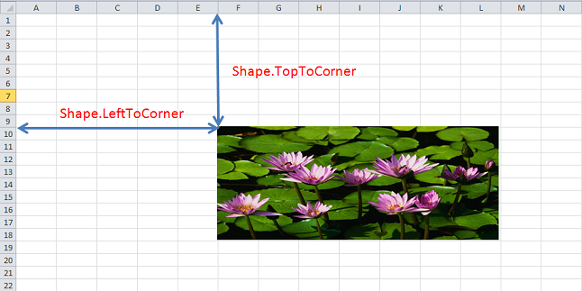

{}

Sometimes, you need to know the absolute position of a shape on a worksheet. Aspose.Cells provides the [**Shape.getLeftToCorner()**](https://reference.aspose.com/cells/java/com.aspose.cells/shape#LeftToCorner) and [**Shape.getTopToCorner()**](https://reference.aspose.com/cells/java/com.aspose.cells/shape#TopToCorner) properties for this purpose. These properties return the absolute position of a shape in a worksheet in pixels.

{}

## **Explanation of the Shape.getLeftToCorner() and Shape.getTopToCorner() properties**

This screenshot explains what distances the [**Shape.getLeftToCorner()**](https://reference.aspose.com/cells/java/com.aspose.cells/shape#LeftToCorner) and [**Shape.getTopToCorner()**](https://reference.aspose.com/cells/java/com.aspose.cells/shape#TopToCorner) properties measure.

**How to Measure absolute position**

The following sample code displays the absolute position of the first shape in a worksheet in pixels. The code displays the following output in the console:



Absolute Position of this Shape is (320, 180)





