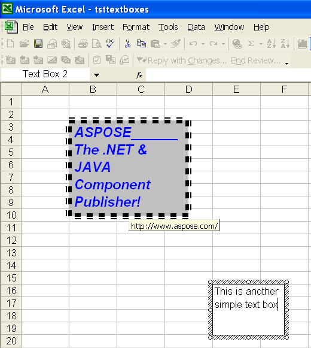
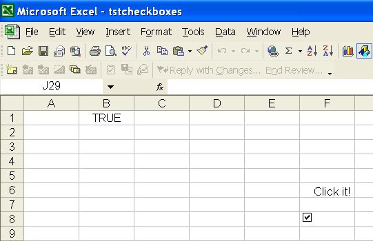
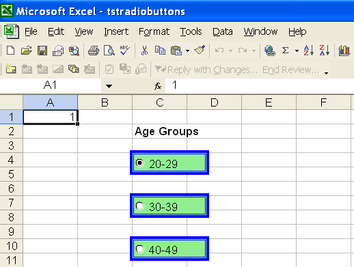
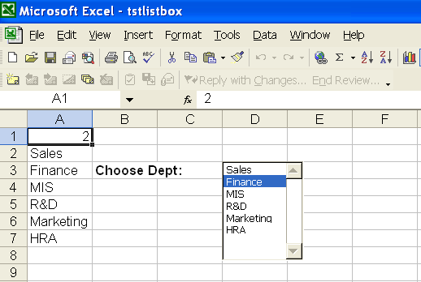
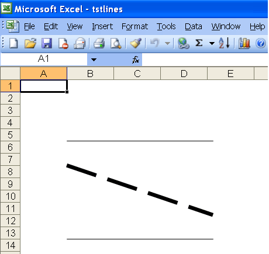
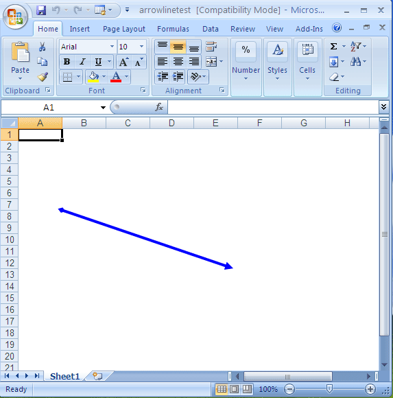
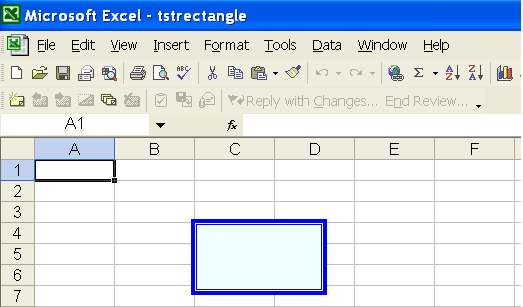
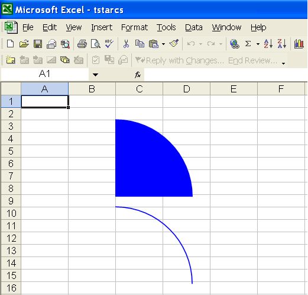
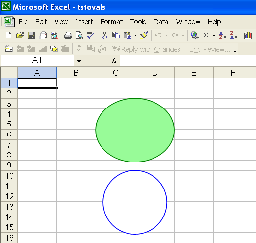

## **Introduction**

Developers can add different drawing objects such as text boxes, check boxes, radio buttons, combo boxes, labels, buttons, lines, rectangles, arcs, ovals, spinners, scroll bars, group boxes etc. Aspose.Cells provides the Aspose.Cells.Drawing namespace which contains all the drawing objects. However, there are a few drawing objects or shapes that are not supported yet. Create these drawing objects in a designer spreadsheet using Microsoft Excel and then import the designer spreadsheet to Aspose.Cells. Aspose.Cells allows you to load these drawing objects from a designer spreadsheet and write them to a generated file.

## **Adding TextBox Control to the Worksheet**

One way to stress important information in a report is to use a text box. For example, add text to highlight the company name or to indicate the geographic region with the highest sales etc. Aspose.Cells provides the TextBoxes class, used to add a new text box to the collection. There is another class, [**TextBox**](https://reference.aspose.com/cells/java/com.aspose.cells/textbox), which represents a text box used to define all types of settings. It has some important members:

- The [**getTextFrame**](https://reference.aspose.com/cells/java/com.aspose.cells/textbox#TextFrame) method returns a [**MsoTextFrame**](https://reference.aspose.com/cells/java/com.aspose.cells/MsoTextFrame) object used to adjust the contents of the text box.
- The [**setPlacement**](https://reference.aspose.com/cells/java/com.aspose.cells/textbox#Placement) method specifies the placement type.
- The [**setFont**](https://reference.aspose.com/cells/java/com.aspose.cells/textbox#Font) method specifies the font attributes.
- The [**addHyperlink**](https://reference.aspose.com/cells/java/com.aspose.cells/textbox#addHyperlink-java.lang.String-) method adds a hyperlink for the text box.
- The [**FillFormat**](https://reference.aspose.com/cells/java/com.aspose.cells/textbox#FillFormat) property returns [**MsoFillFormat**](https://reference.aspose.com/cells/java/com.aspose.cells/MsoFillFormat) object used to set the fill format for the text box.
- The [**LineFormat**](https://reference.aspose.com/cells/java/com.aspose.cells/textbox#LineFormat) property returns the [**MsoLineFormat**](https://reference.aspose.com/cells/java/com.aspose.cells/MsoLineFormat) object usually used to style and weight of the text box line.
- The [**setText**](https://reference.aspose.com/cells/java/com.aspose.cells/textbox#Text) method specifies the input text for the text box.

The following example creates two textboxes in the first worksheet of the workbook. The first text box is well-furnished with different format settings. The second is a simple one.

The following output is generated by executing the code:

**Two text boxes are created in the worksheet** 



## **Manipulating Text Box Controls in the Designer Spreadsheets**

Aspose.Cells also lets you access textboxes in the designer worksheets and manipulate them. Use the [**Worksheet.getTextBoxes**](https://reference.aspose.com/cells/java/com.aspose.cells/worksheet#TextBoxes) property to get the textboxes collection in the sheet.

The following example uses the Microsoft Excel file – tsttextboxes.xls – that we created in the above example. It gets the text strings of the two textboxes and changes the text of the second textbox to save the file.



## **Adding CheckBox Control to the Worksheet**

Check boxes are handy if you want to provide a way for a user to choose between two options, such as true or false; yes or no. Aspose.Cells allows you to use check boxes in worksheets. For instance, you may have developed a financial projection worksheet in which you can either account for a particular acquisition or not. In this case, you might want to place a check box at the top of the worksheet. You can then link the status of this check box to another cell, so that if the check box is selected, the value of the cell is True; if it is not selected, the value of the cell is False.

### **Using Microsoft Excel**

To place a check box control in your worksheet, follow these steps:

1. Make sure the Forms toolbar is displayed.
1. Click the **Check Box** tool on the Forms toolbar.
1. In your worksheet area, click and drag to define the rectangle that will hold the check box and the label beside the check box.
1. Once the check box is placed, move the mouse cursor into the label area and change the label.
1. In the **Cell Link** field, specify the address of the cell to which this check box should be linked.
1. Click on **OK**.

### **Using Aspose.Cells**

Aspose.Cells provides the [**CheckBoxCollection**](https://reference.aspose.com/cells/java/com.aspose.cells/checkboxcollection) class, which is used to add a new check box to the collection. There is another class, [**Aspose.Cells.Drawing.CheckBox**](https://reference.aspose.com/cells/java/com.aspose.cells/CheckBox), which represents a check box. It has some important members:

- The [**setLinkedCell**](https://reference.aspose.com/cells/java/com.aspose.cells/checkbox#LinkedCell) method specifies a cell which is linked to the check box.
- The [**setText**](https://reference.aspose.com/cells/java/com.aspose.cells/checkbox#Text) method specifies the text string associated with the check box. It is the label of the check box.
- The [**setValue**](https://reference.aspose.com/cells/java/com.aspose.cells/checkbox#Value) method specifies if the check box is checked or not.

The following example shows how to add a checkbox to the worksheet. The output below is generated after executing the code.

**A CheckBox is added in the worksheet** 



## **Adding RadioButton Control to the Worksheet**

A radio button, or an option button, is a control made of a round box. The user makes his or her decision by selecting the round box. A radio button is usually, if not always, accompanied by others. Such radio buttons appear and behave as a group. The user decides which button is valid by selecting only one of them. When the user clicks one button, it is filled. When one button in the group is selected, buttons of the same group are empty.

### **Using Microsoft Excel**

To place a Radio Button control in your worksheet, follow these steps:

1. Make sure the **Forms** toolbar is displayed.
1. Click the **Option Button** tool.
1. In the worksheet, click and drag to define the rectangle that will hold the option button and the label beside the option button.
1. Once the radio button is placed in the worksheet, move the mouse cursor into the label area and change the label.
1. In the **Cell Link** field, specify the address of the cell to which this radio button should be linked.
1. Click **OK**.

### **Using Aspose.Cells**

The [**ShapeCollection**](https://reference.aspose.com/cells/java/com.aspose.cells/shapecollection) class provides a method named addShape which can be used to add a radio button control to a worksheet. The method may return a RadioButton object. The class RadioButton represents an option button. It has some important members:

- The setLinkedCell method specifies a cell which is linked to the radio button.
- The setText method specifies the text string associated with the radio button. It is the label of the radio button.
- The Checked property specifies if the radio button is checked or not.
- The setFillFormat method specifies the fill format of the radio button.
- The setLineFormat method specifies the line format styles of the option button.

The following example shows how to add radio buttons to a worksheet. The example adds three radio buttons representing age groups. The following output would be generated after executing the code.

**Some RadioButtons are added in the worksheet** 



## **Adding Combo Box Control to a Worksheet**

To make data entry easier, or to limit entries to certain items that you define, you can create a combo box, or drop-down list of valid entries that is compiled from cells elsewhere on the worksheet. When you create a drop-down list for a cell, it displays an arrow next to that cell. To enter information in that cell, click the arrow, and then click the entry that you want.

### **Using Microsoft Excel**

To place a combo box control in your worksheet, follow these steps:

1. Make sure the **Forms** toolbar is displayed.
1. Click on the **Combo Box** tool.
1. In your worksheet area, click and drag to define the rectangle that will hold the combo box.
1. Once the combo box is placed in the worksheet, right-click the control to click **Format Control** and specify the input range.
1. In the **Cell Link** field, specify the address of the cell to which this combo box should be linked.
1. Click on **OK**.

### **Using Aspose.Cells**

The [**ShapeCollection**](https://reference.aspose.com/cells/java/com.aspose.cells/shapecollection) class provides a method named addShape, which can be used to add a combo box control to the worksheet. The method can return ComboBox object. The class ComboBox represents a combo box. It has some important members:

- The setLinkedCell method specifies a cell which is linked to the combo box.
- The setInputRange method specifies the worksheet range of cells used to fill the combo box.
- The setDropDownLines method specifies the number of list lines displayed in the drop-down portion of a combo box.
- The setShadow method indicates whether the combo box has 3D shading.

The following example shows how to add a combo box to the worksheet. The following output is generated when executing the code.

**A combo box is added in the worksheet** 



## **Adding Label Control to a Worksheet**

Labels are a means of give users information about a spreadsheet's contents. Aspose.Cells makes it possible to add and manipulate labels in a worksheet. The [**ShapeCollection**](https://reference.aspose.com/cells/java/com.aspose.cells/shapecollection) class provides a method named addShape, used to add a label control to the worksheet. The method returns a Label object. The class Label represents a label in the worksheet. It has some important members:

- The setText method specifies a label's caption string.
- The setPlacement method specifies the PlacementType, the way the label is attached to the cells in the worksheet.

The following example shows how to add a label to the worksheet. The following output is generated when executing the code.

**A label is added in the worksheet**



## **Adding List Box Control to a Worksheet**

A list box control creates a list control that allows single or multiple item selection.

### **Using Microsoft Excel**

To place a list box control in a worksheet:

1. Make sure the **Forms** toolbar is displayed.
1. Click on the **List Box** tool.
1. In your worksheet area, click and drag to define the rectangle that will hold the list box.
1. Once the list box is placed in the worksheet, right-click on the control to click **Format Control** and specify the input range.
1. In the **Cell Link** field, specify the address of the cell to which this list box should be linked and set the selection type (Single, Multi, Extend) attribute
1. Click **OK**.

### **Using Aspose.Cells**

The [**ShapeCollection**](https://reference.aspose.com/cells/java/com.aspose.cells/shapecollection) class provides a method named addShape, which is used to add a list box control to a worksheet. The method returns a ListBox object. The class ListBox represents a list box. It has some important members:

- The setLinkedCell method specifies a cell which is linked to the list box.
- The setInputRange method specifies the worksheet range of cells used to fill the list box.
- The setSelectionType method specifies the selection mode of the the list box.
- The setShadow method indicates whether the list box has 3D shading.

The following example shows how to add a list box to the worksheet. The following output is generated when executing the code.

**A list box is added in the worksheet** 



## **Adding Button Control to a Worksheet**

Buttons are useful to perform some actions. Sometimes, it is useful to assign a VBA Macro to the button or assign a hyperlink to open a web page.

### **Using Microsoft Excel**

To place a button control in your worksheet:

1. Make sure the **Forms** toolbar is displayed.
1. Click on the **Button** tool.
1. In your worksheet area, click and drag to define the rectangle that will hold the button.
1. Once the list box is placed in the worksheet, right-click on the control and select **Format Control**, then specify a VBA Macro and attributes related font, alignment, size, margin etc.
1. Click on **OK**.

### **Using Aspose.Cells**

The [**ShapeCollection**](https://reference.aspose.com/cells/java/com.aspose.cells/shapecollection) class provides a method named addShape, used to add a button control to the worksheet. The method may return a Button object. The class Button represents a button. It has some important members:

- The setText method specifies the caption of button.
- The setPlacement method specifies the PlacementType, the way the button is attached to the cells in the worksheet.
- The addHyperlink method adds a hyperlink for the button control. Clicking on the button will navigate to related URL.

The following example shows how to add a button to the worksheet. The following output is generated when executing the code

**A button is added in the worksheet**



## **Adding Line Control to a Worksheet**

Aspose.Cells allows you to draw autoshapes in your worksheets. You may create a line with ease. You are also allowed to format the line. For example, you can change the color of the line, specify the weight and style of the line for your need.

### **Using Microsoft Excel**

1. On the **Drawing** toolbar, click **AutoShapes**, point to **Lines**, and select the line style you want.
1. Drag to draw the line.
1. Do one or both of the following:
   1. To constrain the line to draw at 15-degree angles from its starting point, hold down SHIFT as you drag.
   1. To lengthen the line in opposite directions from the first end point, hold down CTRL as you drag.

### **Using Aspose.Cells**

The [**ShapeCollection**](https://reference.aspose.com/cells/java/com.aspose.cells/shapecollection) class provides a method named addShape, which is used to add a line shape to the worksheet. The method may return a LineShape object. The class LineShape represents a line. It has some important members:

- The setDashStyle method specifies the format of a line.
- The setPlacement method specifies the PlacementType, the way the line is attached to the cells in the worksheet.

The following example shows how to add lines to the worksheet. It creates three lines with different styles. The following output is generated after executing the code

**A few lines are added in the worksheet** 



### **Adding an Arrowhead to a Line**

Aspose.Cells also allows you to draw arrow lines. It is possible to add an arrowhead to a line, and to format the line. For example, you can change the color of the line, or specify the weight and style of the line.

The following example shows how to add an arrowhead to a line. The following output is generated when executing the code.

**A line with arrowhead is added in the worksheet** 



## **Adding Rectangle Control to a Worksheet**

Aspose.Cells allows you to draw rectangle shapes in your worksheets. You may create a rectangle, square etc. You are also allowed to format the filling color and border line color of the control. For example, you can change the color of the rectangle, set the shading color, specify the weight and style of the rectangle for your need.

### **Using Microsoft Excel**

1. On the **Drawing** toolbar, click **Rectangle**.
1. Drag to draw the rectangle.
1. Do one or both of the following:
   1. To constrain the rectangle to draw a square from its starting point, hold down SHIFT as you drag.
   1. To draw a rectangle from a center point, hold down CTRL as you drag.

### **Using Aspose.Cells**

The [**ShapeCollection**](https://reference.aspose.com/cells/java/com.aspose.cells/shapecollection) class provides a method named addShape, which is used to add a rectangle shape to a worksheet. The method can return a RectangleShape object. The class RectangleShape represents a rectangle. It has some important members:

- The setLineFormat method specifies the line format attributes of a rectangle.
- The setPlacement method specifies the PlacementType, the way the rectangle is attached to the cells in the worksheet.
- The FillFormat property specifies the fill format styles of a rectangle.

The following example shows how to add a rectangle to the worksheet. The following output is generated when executing the code.

**A rectangle is added in the worksheet** 



## **Adding Arc Control to the Worksheet**

Aspose.Cells allows you to draw arc shapes in your worksheets. You may create simple and filled arcs. You are allowed to format the filling color and border line color of the control. For example, you can specify / change the color of the arc, set the shading color, specify the weight and style of the shape for your need.

### **Using Microsoft Excel**

1. On the **Drawing** toolbar, click **Arc** in the **AutoShapes**.
1. Drag to draw the arc.

### **Using Aspose.Cells**

The [**ShapeCollection**](https://reference.aspose.com/cells/java/com.aspose.cells/shapecollection) class provides a method named addShape, which is used to add an arc shape to the worksheet. The method can return an ArcShape object. The class ArcShape represents an arc. It has some important members:

- The setLineFormat method specifies the line format attributes of an arc shape.
- The setPlacement method specifies the PlacementType, the way the arc is attached to the cells in the worksheet.
- The FillFormat property specifies the fill format styles of the shape.

The following example shows how to add arc shapes to the worksheet. The example creates two arc shapes: one is filled and other is simple. The following output is generated when executing the code

**Two arc shapes are added to the worksheet** 



## **Adding Oval Control to a Worksheet**

Aspose.Cells allows you to draw oval shapes in worksheets. Create simple and filled oval shapes and format the filling color and border line color of the control. For example, you can specify / change the color of the oval, set the shading color, specify the weight and style of the shape.

### **Using Microsoft Excel**

1. On the **Drawing** toolbar, click **Oval** .
1. Drag to draw the oval.
1. Do one or both of the following:
   1. To constrain the oval to draw a circle from its starting point, hold down SHIFT as you drag.
   1. To draw an oval from a center point, hold down CTRL as you drag.

### **Using Aspose.Cells**

The [**ShapeCollection**](https://reference.aspose.com/cells/java/com.aspose.cells/shapecollection) class provides a method named addShape, which is used to add an oval shape to a worksheet. The method may return an Oval object. The class Oval represents an oval shape. It has some important members:

- The setLineFormat method specifies the line format attributes of an oval shape.
- The setPlacement method specifies the **PlacementType** , the way the oval is attached to the cells in the worksheet.
- The FillFormat property specifies the fill format styles of the shape.

The following example shows how to add oval shapes to the worksheet. The example creates two oval shapes: one is filled oval other is a simple circle. The following output is generated when executing the code.

**Two oval shapes are added in the worksheet** 



## **Advance topics**
- [Add ActiveX Controls using Aspose.Cells](/cells/java/add-activex-controls-using-aspose-cells/)
- [Remove ActiveX Control](/cells/java/remove-activex-control/)
