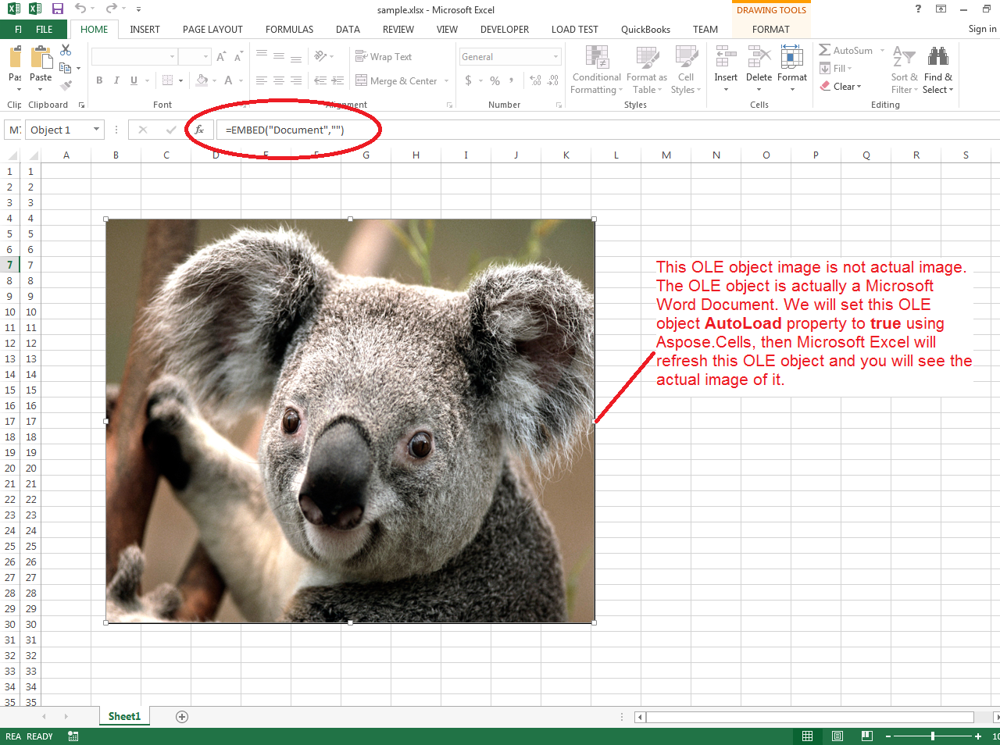
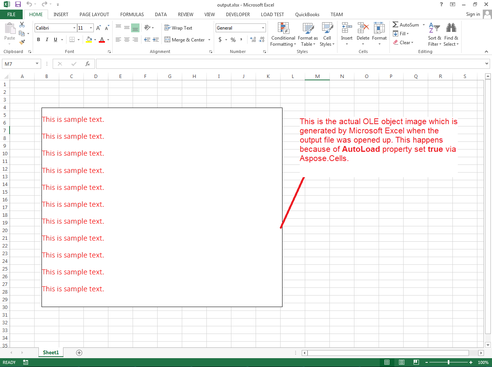

{} 

Aspose.Cells provides the [OleObject.AutoLoad](https://reference.aspose.com/cells/java/com.aspose.cells/oleobject#AutoLoad) property to refresh the OLE object when the excel file is opened in Microsoft Excel. Because of this property, the OLE object will display the correct OLE image generated by Microsoft Excel.

{} 
## **Automatically refresh OLE object via Microsoft Excel using Aspose.Cells**
The following sample code loads the [sample excel file](5473423.xlsx) which has a non-real OLE image. The OLE object is actually a Microsoft Word document but the sample excel file shows the animal image instead of Microsoft Word image. But if you open the [output excel file](5473429.xlsx), you will see Microsoft Excel displays the correct OLE image.

The following screenshot shows how the [sample excel file](5473423.xlsx) looks when opened in Microsoft Excel.

The following screenshot shows how the [output excel file](5473429.xlsx) looks when opened in Microsoft Excel.



