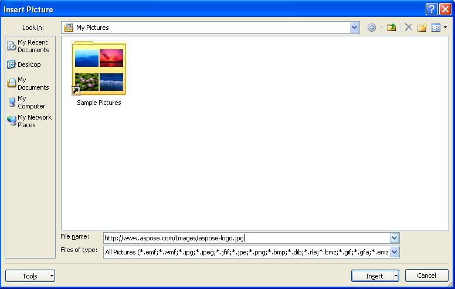
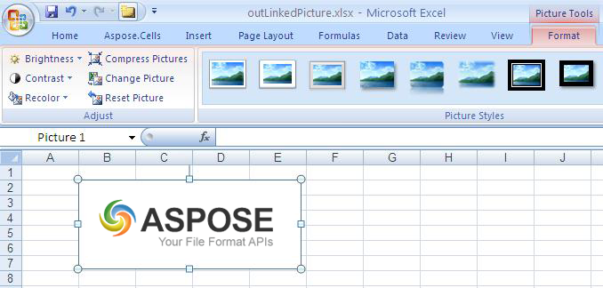

---  
title: Insert a Linked Picture from Web Address  
type: docs  
weight: 50  
url: /java/insert-a-linked-picture-from-web-address/  
ai_search_scope: cells_java
ai_search_endpoint: "https://docsearch.api.aspose.cloud/ask"
---  

{}  

Sometimes you need to insert a picture from the web (http://) into a worksheet. To do so, specify the picture’s URL and the picture will be downloaded every time the spreadsheet is opened in Microsoft Excel. The image is not physically embedded into the Excel document, but points to a web resource.  

{}  

## **Inserting a Linked Picture from Web Address**  

### **Using Microsoft Excel**  

In Microsoft Excel (for example, 2007):  

1. Click the **Insert** menu and select **Picture**.  

  

2. Specify the web address for the picture in the Insert Picture dialog.  

  

The image is inserted.  

  

### **Using Aspose.Cells for Java**  

Aspose.Cells for Java supports adding a linked image using the method [**ShapeCollection.addLinkedPicture(int upperLeftRow, int upperLeftColumn, int height, int width, java.lang.String sourceFullName)**](https://reference.aspose.com/cells/java/com.aspose.cells/shapecollection#addLinkedPicture-int-int-int-int-java.lang.String-).  

The method returns a [**Picture**](https://reference.aspose.com/cells/java/com.aspose.cells/Picture) object.  

The following example shows how to add a linked picture from a web address to a worksheet.  

After running the code, the generated Excel file contains a linked image on the first worksheet.  

**The output file**  

  

  

