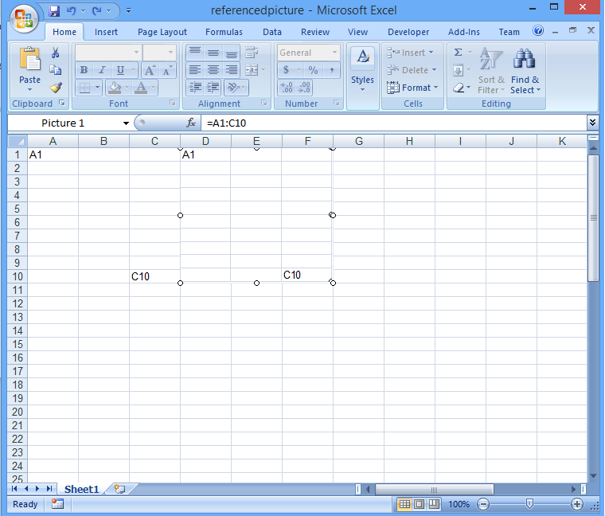

{}

Sometimes you have an empty picture and need to show data or contents in the picture by setting a cell reference in the Formula Bar. Aspose.Cells supports this feature (Microsoft Excel 2010).

{}

## Inserting a Picture Based on Cell Reference

Aspose.Cells supports displaying the contents of a worksheet cell in an image shape. You can link the picture to the cell that contains the data that you want to display. Since the cell or cell range is linked to the graphic object, changes to the data automatically appear in the graphic object. Add a picture to the worksheet by calling the [**addPicture**](https://reference.aspose.com/cells/java/com.aspose.cells/shapecollection#addPicture-int-int-int-int-java.io.InputStream-) method of the [**ShapeCollection**](https://reference.aspose.com/cells/java/com.aspose.cells/ShapeCollection) collection (encapsulated in the [**Worksheet**](https://reference.aspose.com/cells/java/com.aspose.cells/Worksheet) object). Specify the cell range by using the [**setFormula**](https://reference.aspose.com/cells/java/com.aspose.cells/picture#Formula) method of the [**Picture**](https://reference.aspose.com/cells/java/com.aspose.cells/Picture) object.

Below is a screenshot of the file the code below generates.

**Inserting a picture based on cell reference**

## Sample Code


