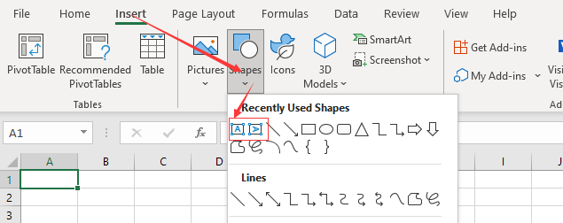

## Add Text Box to Worksheet in Excel

In the Excel program (version 07 and above), there are two places where you can insert text boxes.One in "insert-shapes",the other is on the right side of the top menu of the "Insert" option.

### method one:

### method two:

## How to create

You can create text boxes with horizontal or vertical text.

- Select the corresponding option(horizontal or vertical)
- Left click on the page
- Hold down the left button and drag a distance on the page
- Release the left button

Now you get a text box.

## Add Text Box to Worksheet in Aspose.Cells

When you need to bulk insert TextBox into the worksheet, the manual insertion method is obviously a disaster.If this bothers you, I think this document will help you. [Aspose.Cells](https://products.aspose.com/cells/) provides you with an API to easily do bulk inserts in your code.

The following sample code creates a text box.



You will get a file similar to [result file](result.xlsx).In the file, you will see the following:


