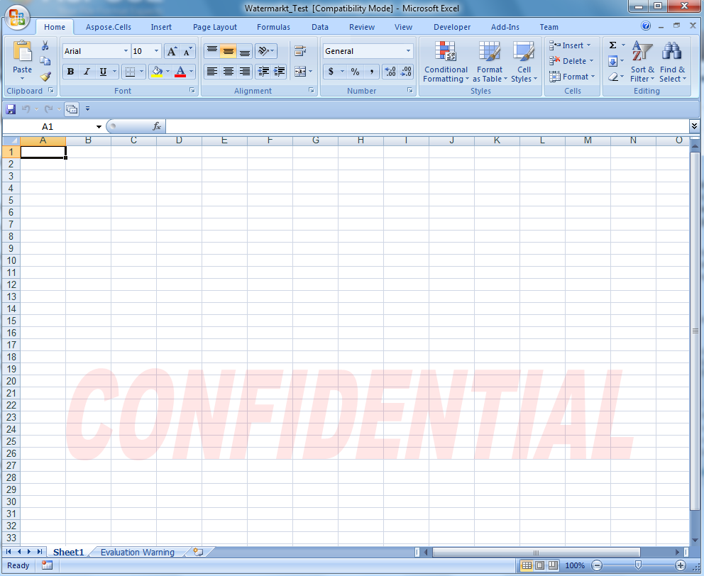

{}

Use WordArt to add special text effects to spreadsheets. For example, stretch a title across the top of the file, decorate text, and make the text fit a preset shape, or apply the text to an Excel sheet as A background watermark. The WordArt becomes an object that you can move or position in spreadsheets to add decoration.

{}

## **Adding WordArt Watermark to Worksheet**

The following example shows how to add a WordArt shape to set a background watermark for a worksheet.

After running the code the output file contains a pale red WordArt watermark.

**The output file**



## **Advance topics**
- [Add Word Art Text with Built-in Styles](/cells/java/add-word-art-text-with-built-in-styles/)
- [Add WordArt Watermark to Chart](/cells/java/add-wordart-watermark-to-chart/)
- [Locking WordArt Watermark](/cells/java/locking-wordart-watermark/)
- [Set preset WordArt style to the text of the shape](/cells/java/set-preset-wordart-style-to-the-text-of-the-shape/)
