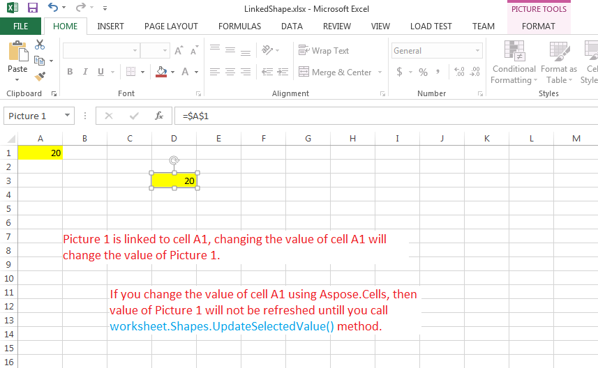

{}

Sometimes, you have a linked shape in your Excel file that is linked to a cell. In Microsoft Excel, changing the value of the linked cell also changes the value of the linked shape. This also works fine with Aspose.Cells when you save your workbook in XLS or XLSX format. However, if you want to save your workbook in PDF or HTML format, you will have to call [**Worksheet.getShapes().updateSelectedValue()**](https://reference.aspose.com/cells/java/com.aspose.cells/shapecollection/#updateSelectedValue--) method to refresh the value of the linked shape.

{}

## Example

The following screenshot shows the source Excel file used in the sample code below. It contains a linked **Picture 1** that is linked to cell A1. We will change the value of cell A1 with Aspose.Cells and then call [**Worksheet.getShapes().updateSelectedValue()**](https://reference.aspose.com/cells/java/com.aspose.cells/shapecollection/#updateSelectedValue--) method to refresh the value of **Picture 1** and save it in PDF format.

You can download the [source Excel file](5472956.xlsx) and the [output PDF](5472955.pdf) from the given links.

### Java code to refresh the values of linked shapes



