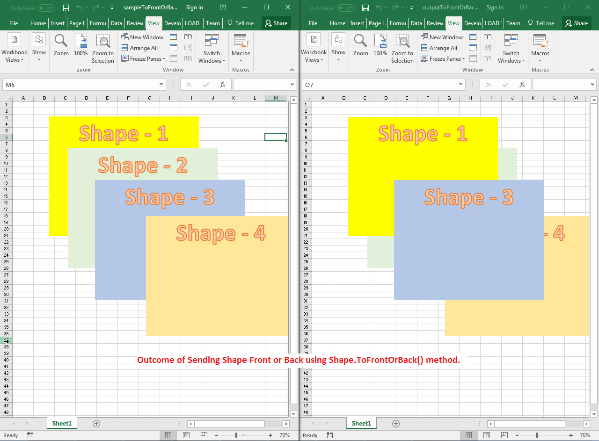

## **Possible Usage Scenarios**

When multiple shapes are present in the same location, their visibility is determined by their z‑order positions. Aspose.Cells provides the **Shape.ToFrontOrBack()** method, which changes the z‑order position of a shape. If you want to send a shape to the back, use a negative number such as -1, -2, -3, etc., and if you want to send a shape to the front, use a positive number such as 1, 2, 3, etc.

## **Send Shape Front or Back inside the Worksheet**

The following sample code demonstrates the usage of the **Shape.ToFrontOrBack()** method. Please see the [sample Excel file](50528362.xlsx) used in the code and the [output Excel file](50528361.xlsx) generated by it. The screenshot shows the effect of the code on the sample Excel file when executed.

## **Sample Code**



