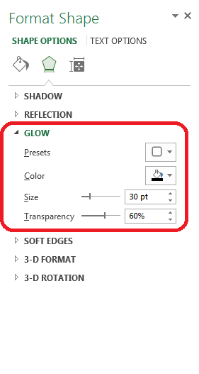

## **Possible Usage Scenarios**
Aspose.Cells provides the Shape.Glow property to work with the glow effect of shape or chart. It contains the following sub properties which you can set to achieve different results as per your requirements.

- GlowEffect.Size
- GlowEffect.Transparency

The following screenshot shows Microsoft Excel interface to set the Glow Effect of Shape.

## **Working with the Glow Effect of Shape or Chart**
The following sample code loads the [source excel file](5472520.xlsx) and accesses the first shape in first worksheet and sets the sub properties of Shape.Glow property and then saves the workbook in [output excel file](5472527.xlsx).
## **Sample Code**



