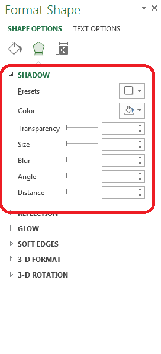

## **Possible Usage Scenarios**
Aspose.Cells provides the [Shape.ShadowEffect](https://reference.aspose.com/cells/java/com.aspose.cells/shape#getShadowEffect--) property to work with the shadow effect of shape or chart. It contains the following sub-properties which you can set to achieve different results as per your requirements.

- [ShadowEffect.Angle](https://reference.aspose.com/cells/java/com.aspose.cells/shadoweffect#setAngle-double-)
- [ShadowEffect.Blur](https://reference.aspose.com/cells/java/com.aspose.cells/shadoweffect#setBlur-double-)
- [ShadowEffect.Color](https://reference.aspose.com/cells/java/com.aspose.cells/shadoweffect#setColor-com.aspose.cells.CellsColor-)
- [ShadowEffect.Distance](https://reference.aspose.com/cells/java/com.aspose.cells/shadoweffect#setDistance-double-)
- [ShadowEffect.PresetType](https://reference.aspose.com/cells/java/com.aspose.cells/shadoweffect#setPresetType-int-)
- [ShadowEffect.Size](https://reference.aspose.com/cells/java/com.aspose.cells/shadoweffect#setSize-double-)
- [ShadowEffect.Transparency](https://reference.aspose.com/cells/java/com.aspose.cells/shadoweffect#setTransparency-double-)

The following screenshot shows the Microsoft Excel interface to set the *Shadow Effect* of Shape.

## **Working with the Shadow Effect of Shape or Chart**
The following sample code loads the [source excel file](5472531.xlsx) and accesses the first shape in the first worksheet and sets the sub-properties of [Shape.ShadowEffect](https://reference.aspose.com/cells/java/com.aspose.cells/shape#getShadowEffect--) property and then saves the workbook in the [output excel file](5472530.xlsx).
## **Sample Code**


