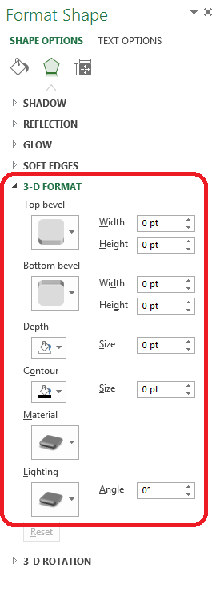

## **Possible Usage Scenarios**
Aspose.Cells provides the [Shape.ThreeDFormat](https://reference.aspose.com/cells/java/com.aspose.cells/shape#ThreeDFormat) property to work with the 3-D Format of shape or chart. It contains different sub-properties which you can set to achieve different results as per your requirements.

The following screenshot shows Microsoft Excel interface to set the 3-D Format of Shape.

## **Working with the ThreeDFormat of Shape or Chart**
The following sample code loads the [source excel file](5472522.xlsx) and accesses the first shape in the first worksheet and sets the sub-properties of [Shape.ThreeDFormat](https://reference.aspose.com/cells/java/com.aspose.cells/shape#ThreeDFormat) property and then saves the workbook in the [output excel file](5472521.xlsx).
## **Sample Code**

