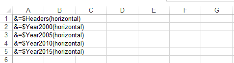
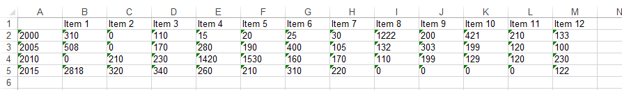
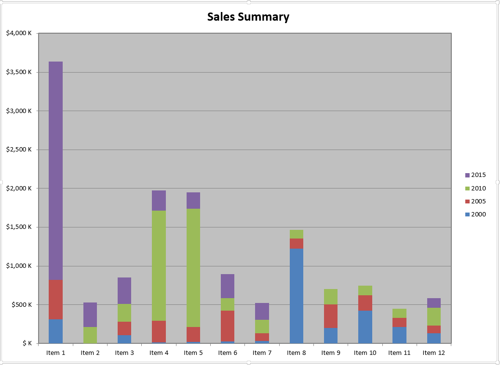

{} 

Aspose.Cells APIs provide the WorkbookDesigner class to work with Smart Markers where the formatting & formulas are placed in the designer spreadsheets and then processed against specified data source(s) to fill up the data according to the Smart Markers. It is also possible to create Excel charts by processing Smart Markers, that will require the following steps.

- Creation of designer spreadsheet
- Processing designer spreadsheet against specified data source
- Creation of chart based on populated data

{} 
## **Creation of Designer Spreadsheet**
A designer spreadsheet is a simple Excel file created with Microsoft Excel application or Aspose.Cells APIs containing the visual formatting, formulas and smart markers, where the contents are to be populated at runtime.

{} 

Detailed information on Smart Markers is available [here](/cells/java/smart-markers/).

{} 

For the sake of simplicity, we will create the designer spreadsheet using the Aspose.Cells for Java API, and later process it against a dynamically created data source for demonstration purposes.

**Java**



 //Create an instance of Workbook

Workbook book = new Workbook();

//Access the first (default) Worksheet from the collection

Worksheet dataSheet = book.getWorksheets().get(0);

//Name the first Worksheet for referencing

dataSheet.setName("ChartData");

//Access the CellsCollection of ChartData Worksheet

Cells cells = dataSheet.getCells();

//Place the markers in the Worksheet according to desired layout

cells.get("A1").putValue("&=$Headers(horizontal)");

cells.get("A2").putValue("&=$Year2000(horizontal)");

cells.get("A3").putValue("&=$Year2005(horizontal)");

cells.get("A4").putValue("&=$Year2010(horizontal)");

cells.get("A5").putValue("&=$Year2015(horizontal)");



If you save the resultant spreadsheet at this stage, the data in the worksheet will look as follow.

## **Processing Designer Spreadsheet**
In order to process the designer spreadsheet, we must have a data source that corresponds to the Smart Markers used in the designer spreadsheet. For instance, we have created a Smart Marker entry as **&=$Headers(horizontal)**, that represents the variable by name Headers whereas the key **(horizontal)** suggests that the data should be populated horizontally.

In order to demonstrate this use case, we will create the data source from scratch and process it against the designer spreadsheet created in previous step. However, in real time scenario, data could already be available for further processing so you can skip the creation of data source if data is already available.

**Java**



 //Create string arrays which will serve as data sources to the smart markers

String[] headers = new String[]{"", "Item 1", "Item 2", "Item 3", "Item 4", "Item 5", "Item 6", "Item 7", "Item 8", "Item 9", "Item 10", "Item 11", "Item 12"};

String[] year2000 = new String[]{"2000", "310", "0", "110", "15", "20", "25", "30", "1222", "200", "421", "210", "133"};

String[] year2005 = new String[]{"2005", "508", "0", "170", "280", "190", "400", "105", "132", "303", "199", "120", "100"};

String[] year2010 = new String[]{"2010", "0", "210", "230", "1420", "1530", "160", "170", "110", "199", "129", "120", "230"};

String[] year2015 = new String[]{"2015", "2818", "320", "340", "260", "210", "310", "220", "0", "0", "0", "0", "122"};



Processing of Smart Markers is quite simple as follow.

**Java**



 //Create an instance of WorkbookDesigner

WorkbookDesigner designer = new WorkbookDesigner();

//Set the Workbook property for the instance of WorkbookDesigner

designer.setWorkbook(book);

//Set data sources for smart markers

designer.setDataSource("Headers", headers);

designer.setDataSource("Year2000", year2000);

designer.setDataSource("Year2005", year2005);

designer.setDataSource("Year2010", year2010);

designer.setDataSource("Year2015", year2015);

//Process the designer spreadsheet against the provided data sources

designer.process();



If you save the spreadsheet at this stage, the data will look as follow.

{} 

Above code snippet uses the existing instance of the Workbook class created in the first step. If you already have the designer spreadsheet file on disk or memory, you can create an instance of Workbook class by loading the existing designer spreadsheet.

{} 
## **Creation of Chart**
Once the data is in place, all we need to do is to create a chart based on the data source. In order to keep the example simple, we will use the Chart.setChartDataRange method so that we do not have to configure the chart further.



The final chart looks as follow.


