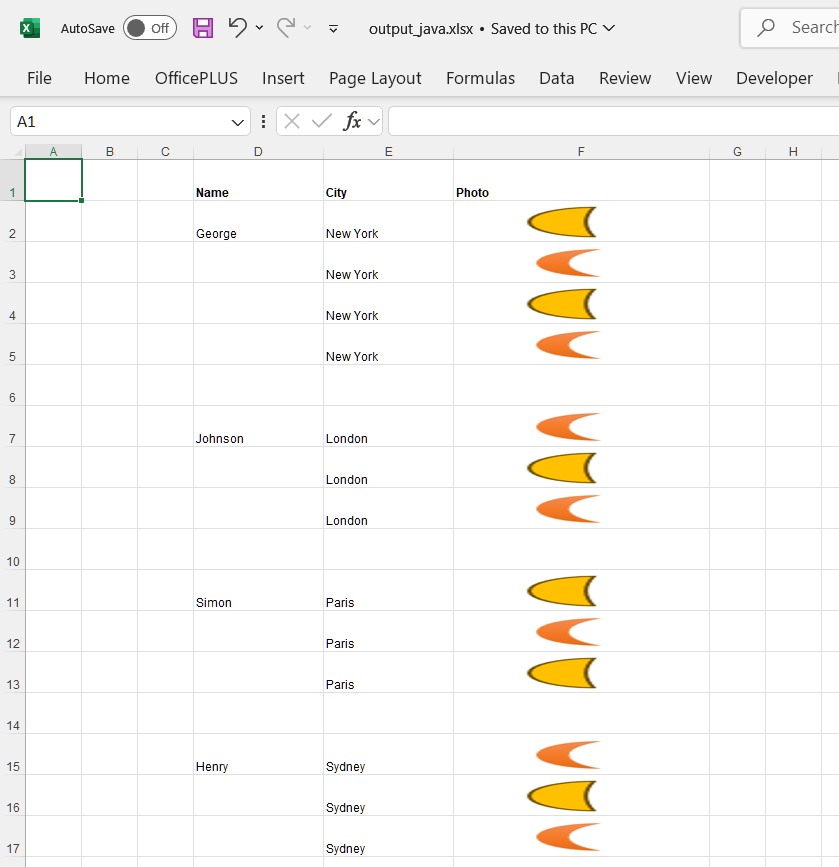

{} 

This article presents an example that illustrates the usage of image markers while grouping data in smart markers.

{} 
## **Using Image Markers while Grouping Data in Smart Markers**
The following sample code creates a workbook and then adds the following smart marker tags in cells D2, E2 and F2 respectively.



 &=Person.Name(group:normal,skip:1)

&=Person.City

&=Person.Photo(Picture:FitToCell)



Then it fills the data source with data and call the [WorkbookDesigner.Process()](https://reference.aspose.com/cells/java/com.aspose.cells/workbookdesigner#process--) method to process smart marker tags. The code uses these images i.e [moon.png](5472549.png) and [moon2.png](5472548.png) but you can use any image. The following screenshot shows the output of this sample code. As you can see, the data in column E and F are grouped with respect to the data in column D.



