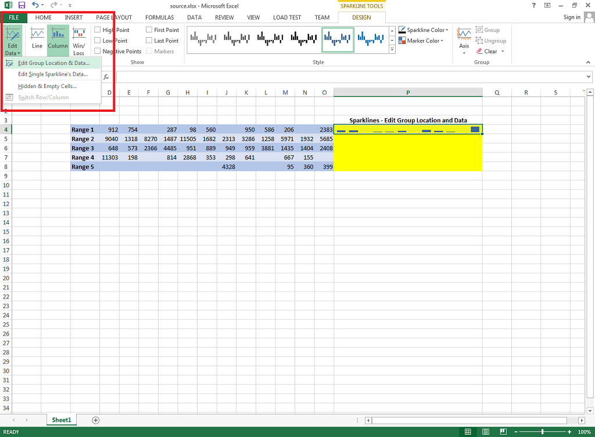

Copy Sparkline by Specifying Data Range and Location of Sparkline Group in MS Excel

Microsoft Excel allows you to copy a Sparkline by specifying the Data Range and Location of Sparkline Group. Follow these steps to copy your Sparkline to other cells.

- Select the cell containing your Sparkline.
- Select **Edit Data** from the **Sparkline** section inside the **Design** tab
- Choose **Edit Group Location & Data...**
- Specify Data Range and Location and click OK.

## Example

Aspose.Cells provides the [**SparklineCollection.add(dataRange, row, column)**](https://reference.aspose.com/cells/java/com.aspose.cells/SparklineCollection) method to specify the Data Range and Location of Sparkline Group.

### Screenshots of the source and output files

The following screenshot shows the source Excel file used inside the code. The red highlighted area shows "**Edit Group Location & Data...**" option to specify the data range and location of the sparkline group. The cell P4 shows the sparkline which will be copied to the other four cells filled with yellow color using Aspose.Cells.

The following screenshot shows the output Excel file generated by the sample code. As you can see, the sparkline in cell P4 has been copied to the next four cells in column P each with different data range.

### Java code to copy sparkline by specifying data range and location of sparkline group

The following sample code loads the source Excel file as shown in the screenshot above, then accesses the first sparkline group and adds data ranges and locations inside the sparkline group. Finally, it writes the output Excel file on disk which is also shown in the screenshot above.


