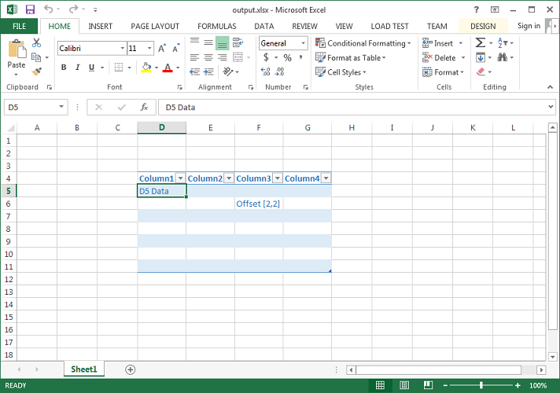

{}

Normally, you add values inside the Table or List Object using the [**Cell.putValue()**](https://reference.aspose.com/cells/java/com.aspose.cells/cell#putValue-boolean-) method, but sometimes you might need to add values inside the Table or List Object using row and column offsets.

In order to access a Table or List Object from a cell, use the [**Cell.getTable()**](https://reference.aspose.com/cells/java/com.aspose.cells/cell#getTable--) method. To add values inside it using row and column offsets, use the [**ListObject.putCellValue(rowOffset, columnOffset, value)**](https://reference.aspose.com/cells/java/com.aspose.cells/listobject#putCellValue-int-int-java.lang.Object-) method.

{}

## Example

### Screenshots comparing the source and output files

The following screenshot shows the source Excel file used in the code. It contains an empty table and highlights cell **D5**, which lies inside the table. We will access this table from cell **D5** using the [**Cell.getTable()**](https://reference.aspose.com/cells/java/com.aspose.cells/cell#getTable--) method and then add values inside it using both the [**Cell.putValue()**](https://reference.aspose.com/cells/java/com.aspose.cells/cell#putValue-boolean-) and [**ListObject.putCellValue(rowOffset, columnOffset, value)**](https://reference.aspose.com/cells/java/com.aspose.cells/listobject#putCellValue-int-int-java.lang.Object-) methods.

The following screenshot shows the output Excel file generated by the code. As you can see, cell **D5** has a value, and cell **F6**, which is at the offset (2, 2) of the table, also has a value.

### Java code to access table from cell and add values inside it using row and column offsets

The following sample code loads the source Excel file shown in the above screenshot, adds values inside the table, and generates the output Excel file shown above.



