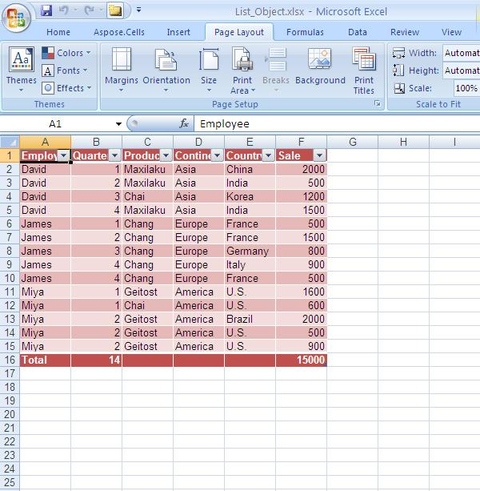

{}

To manage and analyze a group of related data, it is possible to turn a range of cells into a list object (also known as an Excel table). A table is a series of rows and columns that contain related data managed independently from the data in other rows and columns. By default, every column in the table has filtering enabled in the header row so that you can filter or sort your list object data quickly. You can add a total row (a special row in a list that provides a selection of aggregate functions useful for working with numerical data) to the list object that provides a drop-down list of aggregate functions for each total row cell. Aspose.Cells provides options for creating and managing lists (or tables).

{}

## **Formatting a List Object**

Aspose.Cells provides a class, [**Workbook**](https://reference.aspose.com/cells/java/com.aspose.cells/workbook), that represents a Microsoft Excel file. The [**Workbook**](https://reference.aspose.com/cells/java/com.aspose.cells/workbook) class contains a [**Worksheets**](https://reference.aspose.com/cells/java/com.aspose.cells/workbook#getWorksheets--) collection that allows access to each worksheet in an Excel file.

A worksheet is represented by the [**Worksheet**](https://reference.aspose.com/cells/java/com.aspose.cells/worksheet) class. The [**Worksheet**](https://reference.aspose.com/cells/java/com.aspose.cells/worksheet) class provides a wide range of properties and methods for managing worksheets. To create a [**ListObject**](https://reference.aspose.com/cells/java/com.aspose.cells/ListObject) in a worksheet, use [**ListObjects**](https://reference.aspose.com/cells/java/com.aspose.cells/worksheet#getListObjects--) collection property of the [**Worksheet**](https://reference.aspose.com/cells/java/com.aspose.cells/worksheet) class. Each [**ListObject**](https://reference.aspose.com/cells/java/com.aspose.cells/ListObject) is, in fact, an object of the [**ListObjectCollection**](https://reference.aspose.com/cells/java/com.aspose.cells/listobjectcollection) class, which further provides the add method to add a List object and specify the range of cells it should encompass. According to the specified range of cells, a [**ListObject**](https://reference.aspose.com/cells/java/com.aspose.cells/ListObject) is created in the worksheet by Aspose.Cells. Use attributes (for example, [**TableStyleType**](https://reference.aspose.com/cells/java/com.aspose.cells/listobject#getTableStyleType--) of the [**ListObject**](https://reference.aspose.com/cells/java/com.aspose.cells/ListObject) class to format the table for your requirement.

The example below adds sample data to a worksheet, adds a [**ListObject**](https://reference.aspose.com/cells/java/com.aspose.cells/ListObject) and applies default styles to it. [**ListObject**](https://reference.aspose.com/cells/java/com.aspose.cells/ListObject) styles are supported by Microsoft Excel 2007/2010.

The following output is generated when the code is executed.

**A formatted table is created in the worksheet** 



