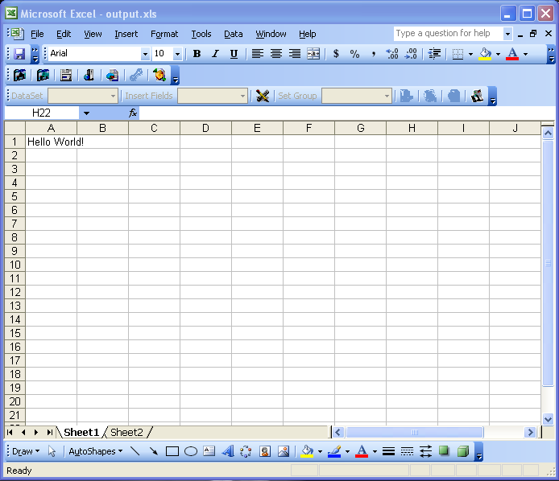

{}

This article gives the basic information and code segment that ColdFusion developers need to use Aspose.Cells for Java in there ColdFusion application.

This article shows how to create a simple web page using ColdFusion and use Aspose.Cells for Java to generate a simple Excel File.

{}

## **Aspose.Cells: The Real Product**

With Aspose.Cells developers can export data, format spreadsheets in every detail and at every level, import images, import charts, create charts, manipulate charts, stream Microsoft Excel data, save in various formats including XLS, CSV, SpreadsheetML, TabDelimited, TXT, XML ([Aspose.Pdf](https://products.aspose.com/pdf/java/) integrated) and many more.

To find out more about the product information, features and for a programmer's guide, refer to the Aspose.Cells documentation and online featured [demos](https://github.com/aspose-cells/Aspose.Cells-for-Java). You can [download](https://downloads.aspose.com/cells/java) and evaluate it for free.

### **Prerequisites**

To use Aspose.Cells for Java in ColdFusion applications, copy the Aspose.Cells.jar file to the {InstallationFolder\\}\wwwroot\WEB-INF\lib folder.

Do not forget to restart the ColdFusion application server after putting new JARs in the lib folder.

### **Using Aspose.Cells for Java & ColdFusion to Create an Excel file**

Below, we create a simple application that generates an empty Microsoft Excel file, inserts some content and saves it as an XLS file.

Following is the actual code (ColdFusion & Aspose.Cells for Java). After executing the code, an Excel file, output.xls, is generated.

**Generated output.xls**

**Java**



 <html>

<head><title>Hello World!</title></head>

<body>

    <b>This example shows how to create a simple MS Excel Workbook using Aspose.Cells</b>

    <cfset workbook=CreateObject("java", "com.aspose.cells.Workbook").init()>

    <cfset worksheets = workbook.getWorksheets()>

    <cfset sheet= worksheets.get("Sheet1")>

    <cfset cells= sheet.getCells()>

    <cfset cell= cells.getCell(0,0)>

    <cfset cell.setValue("Hello World!")>

    <cfset workbook.save("C:\output.xls")>

</body>

</html>



## **Summary**

{}

This article explains how to use Aspose.Cells for Java with ColdFusion.

Aspose.Cells offers great flexibility and provides outstanding speed, efficiency and reliability. Aspose.Cells has benefited from years of research, design and careful tuning.

We welcome queries, comments and suggestions in the [Aspose.Cells Forum](https://forum.aspose.com/c/cells/9).

{}

